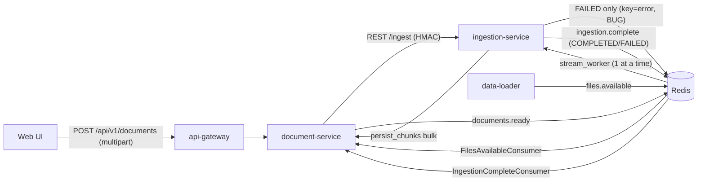
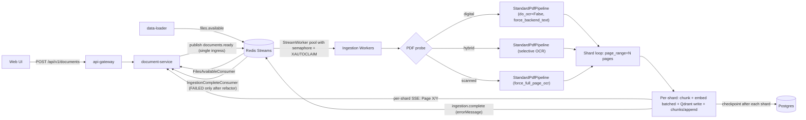

# Enterprise ingestion redesign

## 1. Current state (verified, with the actual problems)



Verified problems:

- **Two ingress paths into ingestion-service** (REST `/ingest` and `documents.ready` stream) → duplicated success/fail semantics, two retry models, the REST path keeps breaking ([`api/main.py:228-327`](services/ingestion-service/src/api/main.py)).
- **HTTP failure payload bug**: publishes key `"error"`; Kotlin `IngestionCompleteEvent` expects `"errorMessage"` ([`api/main.py:296-315`](services/ingestion-service/src/api/main.py) vs [`StreamTopics.kt:45`](services/document-service/src/main/kotlin/com/docintel/document/messaging/StreamTopics.kt)).
- **Stream path emits COMPLETED twice**: `bulkPersistChunks` flips status + SSE; then `IngestionCompleteConsumer.markDocumentCompleted` does it again.
- **Stream consumer is sequential** (`xreadgroup` count=10 but yields one-at-a-time and awaits each `_handle_message`) → 1 doc/process at a time ([`stream_worker.py`](services/ingestion-service/src/stream_worker.py), [`messaging.py:129-177`](lib/docintel-common/docintel_common/messaging.py)).
- **No PEL reclaim**: `XACK` runs after FAILED too → poison messages dropped, no retry.
- **`run_ingestion()` is monolithic**: full `raw_docs` in RAM → full chunks list → full embeddings list → full chunk dicts for HTTP. Triple-resident at peak. **OOM-killed (exit 137)** on the 59 MB / 250-page NCERT PDF.
- **No per-page or shard streaming**; `DOCLING_MAX_WORKERS` and `MIN_CHUNK_CHARS` are dead config.
- **OCR runs blanket** because we set `do_ocr=True` and never probe; though docling itself does have selective per-page OCR via `bitmap_area_threshold` ([`base_ocr_model.py:38-96`](https://github.com/docling-project/docling/blob/v2.92.0/docling/models/base_ocr_model.py)) we are not exploiting it intelligently.

## 2. Target architecture



**Single ingress, three independent properties:**

- **C — Memory-bounded streaming**: outer-loop shard PDFs by `page_range=(start, start+SHARD_PAGES)`. Each shard's `DoclingDocument` gets GC'd before next shard. Inside a shard, docling's `StandardPdfPipeline` already provides bounded-queue backpressure (`queue_max_size`, `ocr_batch_size`, `layout_batch_size`, `table_batch_size`).
- **D — Smart routing**: cheap PDF probe (page count + text-cell density + bitmap coverage on 3 sampled pages) selects one of three `PdfPipelineOptions` presets before docling runs.
- **B — Quality preserved**: `do_table_structure=True` on all profiles (TableFormer only fires on layout-detected tables anyway, so it's free on digital PDFs without tables).

## 3. Implementation phases

### Phase 1 — Streamlined ingress (no behavior change for sample loader)

Files:

- [`services/document-service/src/main/kotlin/com/docintel/document/service/DocumentService.kt`](services/document-service/src/main/kotlin/com/docintel/document/service/DocumentService.kt)
- [`services/document-service/src/main/kotlin/com/docintel/document/service/IngestionServiceClient.kt`](services/document-service/src/main/kotlin/com/docintel/document/service/IngestionServiceClient.kt)
- [`services/document-service/src/main/kotlin/com/docintel/document/messaging/DocumentStreamPublisher.kt`](services/document-service/src/main/kotlin/com/docintel/document/messaging/DocumentStreamPublisher.kt)
- [`services/document-service/src/main/kotlin/com/docintel/document/messaging/IngestionCompleteConsumer.kt`](services/document-service/src/main/kotlin/com/docintel/document/messaging/IngestionCompleteConsumer.kt)
- [`services/ingestion-service/src/api/main.py`](services/ingestion-service/src/api/main.py)
- [`services/ingestion-service/src/stream_worker.py`](services/ingestion-service/src/stream_worker.py)
- [`lib/docintel-common/docintel_common/messaging.py`](lib/docintel-common/docintel_common/messaging.py)

Changes:

- `DocumentService.processDocument` no longer calls `IngestionServiceClient.triggerIngestion`. Instead it publishes a `DocumentReadyEvent` to `documents.ready` (same payload `FilesAvailableConsumer` uses today). `IngestionServiceClient` is removed; only the vector-delete clients survive (move to a dedicated `VectorStoreClient`).
- `ingestion-service` REST `/ingest` becomes test-only: gated by `INGESTION_REST_ENABLED=false` (default). Production traffic only hits `stream_worker`.
- Stream `_handle_message` writes one source-of-truth completion event with key `errorMessage` (delete the `error` key path).
- Drop the double-COMPLETED: `DocumentService.bulkPersistChunks` only stores chunks (no status flip, no SSE). `IngestionCompleteConsumer` becomes the sole status-transition authority for terminal states (`COMPLETED`/`FAILED`); its event also carries `chunkCount` and the per-stage payload for SSE.
- `messaging.py`: add `XAUTOCLAIM` recovery loop and a configurable max-retry / dead-letter topic. `_handle_message` only acks on terminal success or after retries exhausted (FAILED with no retries left → DLQ + ack).

### Phase 2 — Smart PDF routing (D)

New file: [`services/ingestion-service/src/pdf_probe.py`](services/ingestion-service/src/pdf_probe.py)

```python
def probe_pdf(path: Path) -> PdfProfile:
    """
    Cheap pre-flight scan: page count + text-cell density + bitmap coverage on
    sampled pages (first, middle, last). Returns the routing decision.
    """
    backend = PyPdfiumDocumentBackend(path)
    total_pages = backend.page_count
    sample_idxs = sorted({0, total_pages // 2, total_pages - 1})

    text_chars = 0
    bitmap_cov = 0.0
    for i in sample_idxs:
        page = backend.load_page(i)
        text_chars += sum(len(c.text) for c in page.get_text_cells())
        bitmap_cov += page.bitmap_coverage_estimate()

    avg_text = text_chars / len(sample_idxs)
    avg_bitmap = bitmap_cov / len(sample_idxs)

    if avg_text > 500 and avg_bitmap < 0.3:
        return PdfProfile("digital",  do_ocr=False, force_backend_text=True)
    if avg_text > 200:
        return PdfProfile("hybrid",   do_ocr=True,  force_full_page_ocr=False)
    return PdfProfile("scanned",      do_ocr=True,  force_full_page_ocr=True)
```

Wire in [`services/ingestion-service/src/pipeline.py::_get_docling_converter`](services/ingestion-service/src/pipeline.py): build `PdfPipelineOptions` from the probed profile (current code unconditionally enables OCR + EasyOCR — replace with profile-driven selection). `do_table_structure=True` on all three profiles.

### Phase 3 — Page-sharded streaming pipeline (C)

Refactor [`pipeline.py::run_ingestion`](services/ingestion-service/src/pipeline.py) (lines 460-576). Replace the monolithic conversion + ingestion run with:

```python
def run_ingestion(file_paths, document_id, tenant_id, ...):
    profile = probe_pdf(file_paths[0])  # PDFs only; text/* takes the small path
    total_pages = profile.page_count
    shard_size = settings.docling_shard_pages  # default 25

    checkpoint = load_checkpoint(document_id)  # None for new docs
    start_page = checkpoint.last_completed_page + 1 if checkpoint else 0
    chunk_offset = checkpoint.chunk_count_so_far if checkpoint else 0
    total_chunks = chunk_offset

    converter = build_docling_converter(profile)  # one instance per call

    while start_page < total_pages:
        end_page = min(start_page + shard_size, total_pages)
        emit_sse(document_id, stage=f"Converting pages {start_page+1}-{end_page}/{total_pages}")

        result = converter.convert(file_paths[0], page_range=(start_page, end_page))
        chunks = list(hybrid_chunker.chunk(result.document))

        # Embed in batches of EMBEDDING_BATCH (e.g. 32) so peak embedding RAM
        # is bounded regardless of shard chunk count.
        embedded = embed_in_batches(chunks, batch_size=settings.embedding_batch_size)
        document_store.write_documents(embedded)  # already chunked write

        chunks_payload = build_chunk_payloads(embedded, chunk_id_offset=chunk_offset)
        doc_client.append_chunks(document_id, tenant_id, chunks_payload)  # NEW endpoint
        chunk_offset += len(chunks_payload)
        total_chunks += len(chunks_payload)

        save_checkpoint(document_id, last_completed_page=end_page-1,
                        chunk_count_so_far=chunk_offset)

        del result, chunks, embedded, chunks_payload
        gc.collect()

        start_page = end_page

    delete_checkpoint(document_id)
    return {"chunk_count": total_chunks, "domain": profile.domain or "auto"}
```

New persistence endpoint on document-service: `POST /internal/documents/{id}/chunks/append` (additive, returns running total). Existing `bulk` endpoint is kept for backwards-compat with the data-loader's text path.

New table for resume: `documents.processing_checkpoints (document_id PK, last_completed_page int, chunk_count_so_far int, profile jsonb, updated_at timestamptz)`. RLS policy mirrors `documents` table.

For text/* files (sample-doc loader's bread and butter): `total_pages = 1`, single shard, behavior identical to today minus the in-memory accumulation.

Idempotency: chunk IDs are deterministic (`document_id + chunk_index`). `DuplicatePolicy.OVERWRITE` on Qdrant + `INSERT ... ON CONFLICT (id) DO UPDATE` on the chunks table → safe to re-run any shard.

### Phase 4 — Worker concurrency + per-tenant fairness

In [`stream_worker.py`](services/ingestion-service/src/stream_worker.py):

- Drive `DOCLING_MAX_WORKERS` (currently dead). Wrap dispatch in an `asyncio.Semaphore(N)` so up to N docs process concurrently per process.
- Replace the single `xreadgroup` loop with **per-tenant round-robin**: read messages, group by `tenantId`, dispatch one-per-tenant per scheduling round. Prevents one tenant's GB textbook from starving others (in-process; cluster-wide fairness comes for free since all consumers compete on the same group).
- Use a dedicated `ProcessPoolExecutor` for `run_ingestion` (instead of the default thread pool) — Python GIL makes the Haystack chain CPU-bound, and a process pool gives a hard memory ceiling per worker (we can `kill -9` an OOM'd worker without taking down the API).

### Phase 5 — Per-stage SSE + UI progress

Expand `DocumentStatusEvent` in [`services/document-service/src/main/kotlin/com/docintel/document/sse/DocumentStatusEvent.kt`](services/document-service/src/main/kotlin/com/docintel/document/sse/DocumentStatusEvent.kt) with optional `progress` field `{currentPage, totalPages, currentStage}`. Ingestion-service publishes a lightweight stream event `documents.progress` per shard; `document-service` fans out via existing SSE. UI ([`services/web-ui/src/routes/documents/+page.svelte:740-820`](services/web-ui/src/routes/documents/+page.svelte)) shows "Page 47/250 • Converting" instead of just a spinner.

## 4. Acceptance criteria

- The 59 MB / ~250-page NCERT textbook completes (no OOM, finite memory) on the current 4 GB container reservation.
- All 300 existing seed sample docs ingest successfully through the new pipeline (no regression on data-loader path).
- A 1-page synthetic PDF still ingests in < 30 s end-to-end (no smart-routing overhead penalty).
- Killing the worker container mid-ingest of the NCERT doc, then restarting, resumes from the last completed shard (chunk count grows monotonically; no duplicates in Qdrant or chunks table).
- Two tenants ingesting concurrently — small-doc tenant completes within 2× normal latency even when the big-doc tenant is mid-textbook.
- REST `/ingest` returns 404 in production config; integration tests for the user-upload path drive everything through `documents.ready`.
- A scanned (image-only) PDF goes through the `scanned` profile; OCR runs full-page; output chunks are non-empty.

## 5. Risks & mitigations

- **Docling does not expose true per-page streaming** (verified in source). Mitigation: outer-loop `page_range` sharding gives equivalent memory bounds; relies on a public, stable docling parameter.
- **HybridChunker doesn't re-chunk well across shard boundaries** (a section split across page 25→26 will produce two partial chunks). Mitigation: small overlap between shards (e.g. last 1 page) and metadata `is_continuation=true`; or accept slightly suboptimal chunk boundaries on shard seams (acceptable trade-off for unbounded-doc support).
- **Process pool + EasyOCR + Torch model loading** can be slow per-worker cold start. Mitigation: workers are persistent (initialized once in process); only on container restart do we pay the load cost.
- **Checkpoint table grows unbounded** if cleanup misses. Mitigation: nightly job in `ReconciliationSweeper` to delete checkpoints for COMPLETED/FAILED docs older than 24h.
- **PDF probe could mis-classify** unusual docs. Mitigation: `probe_pdf` decision overridable via document metadata `force_ocr_strategy` (digital | hybrid | scanned); UI exposes it as an advanced option later.

## 6. Sample-doc compatibility

`data-loader` is untouched. `files.available` schema unchanged. `FilesAvailableConsumer` keeps publishing `documents.ready`. The change is invisible to the data-loader: sample docs go through the **same** new sharded pipeline, get the **same** smart routing (text/* short-circuits to single-shard), and the **same** SSE flow. One pipeline, two ingress sources, no special cases.