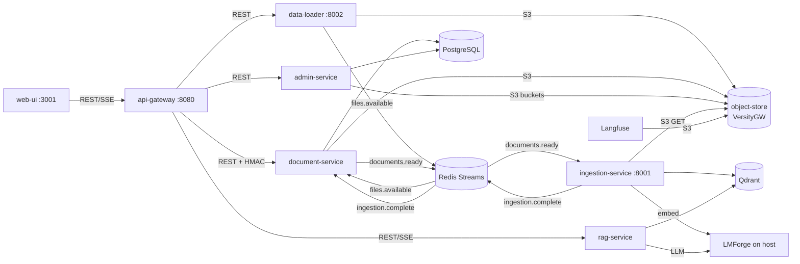

# DocIntel — maintainer mental model

What a developer or agent joining today needs in order to work on the repo without asking. README
is for users. This file is for maintainers. Coverage grows capability by capability: sections cover
what has been documented so far, and §8 lists the gaps.

## 1. Start here

DocIntel is a multi-tenant document Q&A system.
- Documents go in through document-service, either uploaded by users or loaded by data-loader.
  Their bytes land in an S3-compatible object store.
- ingestion-service parses, chunks and embeds them into Qdrant.
- rag-service answers questions with hybrid retrieval and an LLM served by LMForge on the host.
- Kotlin services own the HTTP edge and document records. Python services own ML work.
- Redis Streams connect the pipeline stages. PostgreSQL row-level security isolates tenants.

Reading order: this file §2 → [ADR index](#8-decisions-index) → [contracts](../contracts/) →
the flow in §4 for the capability being changed.

Run and demo (5 minutes once images exist):

```bash
./scripts/setup.sh          # once, and after pulls that add .env keys: backfills .env from .env.example
./scripts/start.sh --build  # whole stack; refuses to start if object-store keys are missing
open http://localhost:3001  # log in, upload a PDF on Documents, ask about it in Chat
open http://localhost:19001 # object store WebUI: the file under docintel-<tenant>/docs/<hash>/
```

When something fails: `./scripts/logs.sh debug` (gateway + rag), `docker compose logs <service>`,
`docker compose ps` for health, the bootstrap logs in `logs/bootstrap/`, and §9.

## 2. System map



Rule of thumb: **REST for questions and commands that need an answer now; streams for facts that
later stages react to.** Every hop into an object (upload, ingest, delete) carries the
`{bucket, objectPath}` pair defined in [contracts/object-storage.md](../contracts/object-storage.md).

| Folder | Holds |
|---|---|
| `services/` | one directory per deployable: Kotlin (`api-gateway`, `document-service`, `admin-service`), Python (`rag-service`, `ingestion-service`, `data-loader`, `analytics-service-py`), `web-ui` (SvelteKit) |
| `lib/docintel-common/` | shared Python mechanisms: messaging, errors, tracing, internal auth, object store |
| `config/` | Postgres init, Zitadel blueprints, OPA policies, Prometheus/Grafana |
| `scripts/` | setup/start/stop/cleanup/backup; `scripts/lib/` holds the sourced helpers |
| `terraform/` | OpenTofu stacks run by `start.sh`: `infra` (Qdrant collections), `identity` (Zitadel) |
| `tests/` | cross-service contract, e2e, integration and script (bats) tests |
| `docs/` | ADRs, contracts, versions, this file |

## 3. Cross-cutting mechanisms

### Object storage

The idea to own: **the S3 API is the contract; the server is configuration**
([ADR-0001](../adr/0001-object-storage-versitygw.md)).
- Locally the `object-store` compose service runs VersityGW. It stores each object as a plain file
  under `/data/<bucket>/<key>`, with `Content-Type`/`ETag` in xattrs.
- Pointing `OBJECT_STORE_ENDPOINT` at AWS S3, R2 or Ceph RGW replaces it; nothing else changes.

| File | Role |
|---|---|
| `services/document-service/.../config/ObjectStoreProperties.kt` | validated `object-store.*` settings; startup fails on a blank key or a non-http endpoint |
| `services/document-service/.../config/ObjectStoreConfig.kt` | `S3Client`: endpoint override, path style, Apache HTTP client timeouts, SDK `STANDARD` retries |
| `services/document-service/.../service/StorageService.kt` | bucket naming, content-addressable keys, ensure-bucket, upload, prefix delete in 1000-key batches |
| `services/admin-service/.../service/ProvisioningService.kt` | best-effort tenant bucket create/delete with error-code mapping |
| `lib/docintel-common/docintel_common/object_store.py` | Python adapter: `ObjectStoreConfig.from_env`, `ObjectStore`, `ObjectNotFoundError` / `ObjectStoreError` |
| `services/data-loader/src/storage.py` | hash, key and upload for sample datasets |
| `services/ingestion-service/src/adapters/object_store_adapter.py` | download one object to a temp file; cleans up on failure |
| `docker-compose.yml` (`object-store`, `object-store-init`) | server, healthcheck, Langfuse bucket bootstrap |
| `scripts/check-object-store-pin.sh` | keeps the VersityGW tag in compose and tests identical |

Errors are typed at the edge:
- Python callers see `ObjectNotFoundError` (missing bucket or key: terminal) or `ObjectStoreError`
  (retryable from the caller's point of view).
- Kotlin callers see the SDK's `NoSuchKeyException`, `NoSuchBucketException` and `S3Exception`.

Timeouts: connect 5 s, socket/read 60 s; a Kotlin call is capped at 5 min including retries in document-service (uploads) and 30 s in admin-service.

### Messaging

Redis Streams with consumer groups. Topic names live in `docintel_common.messaging` and Kotlin
`StreamTopics`. A consumer acks only on terminal outcomes; unacked entries are reclaimed
(`XAUTOCLAIM`) and retried up to a delivery limit. Payload contracts:
[contracts/events.md](../contracts/events.md).

### Config and secrets

Settings come from the environment. `.env.example` holds labelled dev defaults, and `setup.sh` /
`setup-lmforge.sh` backfill any key missing from `.env` (`setup_common_env` in
`scripts/lib/setup-common.sh`). Object-store credentials have no in-code defaults: services and
`start.sh` refuse to start without them.

### Tenancy and internal auth

- Per-tenant isolation:
  - PostgreSQL row-level security, with session variables set by `TenantAwareDataSource`;
  - per-tenant Qdrant collections;
  - per-tenant buckets.
- Service-to-service HTTP carries `X-Internal-Service-Token`, an HMAC checked by
  `InternalAuthFilter`.

## 4. Flows

### Document upload and ingestion

Trigger: `POST /internal/documents` (multipart, via the gateway), or data-loader publishing
`files.available`.

```mermaid
sequenceDiagram
  participant GW as api-gateway
  participant DOC as document-service
  participant OS as object-store
  participant R as Redis Streams
  participant ING as ingestion-service
  GW->>DOC: POST /internal/documents
  DOC->>OS: HEAD/CREATE docintel-{tenant}; PUT docs/{hash}/original.ext
  DOC->>DOC: insert document PENDING
  DOC->>R: documents.ready {bucket, objectPath}
  R->>ING: documents.ready
  ING->>OS: GET object → temp file
  ING->>ING: parse, chunk, embed, write Qdrant
  ING->>DOC: persist chunks (REST)
  ING->>R: ingestion.complete
  R->>DOC: ingestion.complete → COMPLETED / FAILED
```

1. document-service hashes tenant id + bytes. A known hash returns the existing document
   (dedup); FAILED or DELETING ones are re-processed.
2. `StorageService.storeFile` ensures the tenant bucket and PUTs at the content-addressable key.
3. The document row is saved PENDING. `processDocument` publishes `documents.ready`.
4. The data-loader path is the same from step 3:
   - data-loader uploads with `docintel_common.object_store`, then publishes `files.available`;
   - `FilesAvailableConsumer` registers the document and publishes `documents.ready`.
5. ingestion-service downloads through `ObjectStoreAdapter`, runs the pipeline, persists chunks
   and publishes `ingestion.complete`.

| When things go wrong | Effect |
|---|---|
| object store down during upload | upload request fails (5xx); nothing registered |
| object missing at ingest | `FAILED` + ack, no retry (`ObjectNotFoundError`) |
| other object-store / pipeline error at ingest | `FAILED`, not acked → redelivered up to the limit |
| `files.available` without `objectPath` | logged, acked, skipped |

Demo: upload in the UI, then find the object in the WebUI at `http://localhost:19001`.

### Document deletion

Trigger: `DELETE /internal/documents/{id}`, which returns 202.

1. `markForDeletion` sets the document to `DELETING` and inserts a `deletion_tasks` row (outbox) in
   one transaction.
2. `DeletionTaskWorker` polls every 30 s:
   - deletes the Qdrant vectors (`qdrant_done`);
   - calls `StorageService.deleteDocumentFiles`, which lists `docs/{hash}/` and runs batched
     `DeleteObjects` (`object_store_done`);
   - when both flags are set, deletes the chunk and document rows.
3. A failed step retries with exponential backoff (2^attempts min, capped at 60). After 10
   attempts the task is `DEAD`.
4. A missing tenant bucket counts as deleted. A per-key failure throws `ObjectDeletionException`
   and is retried.

### Tenant bucket lifecycle

- Tenant creation calls `ProvisioningService.createTenantBucket`.
  - It is best-effort: document-service creates the bucket lazily anyway.
- Tenant deletion calls `deleteTenantBucket` after queueing document deletion.
  - S3 refuses to delete a non-empty bucket. That is logged as `BucketNotEmpty`, and the bucket
    stays for an operator (see §8).

## 5. Data and contracts

- [contracts/object-storage.md](../contracts/object-storage.md): buckets, keys, hash, client
  settings, relied-on S3 semantics.
- [contracts/reranker.md](../contracts/reranker.md): what rag-service needs from LMForge
  `/v1/rerank`, the error codes, degraded behaviour and calibration.
- [contracts/events.md](../contracts/events.md): `files.available`, `documents.ready`,
  `ingestion.complete`.
- REST: `docs/api/openapi.json` (generated by `scripts/generate-openapi.py`).
- document-service schema: Flyway `services/document-service/src/main/resources/db/migration/`.
  - `deletion_tasks.object_store_done` comes from V6.

## 6. Recipes

**Add an object-store operation (Kotlin):**
1. Add a method to `StorageService` (or `ProvisioningService`) using the injected `S3Client`.
2. Map the specific SDK exceptions it can raise; never `catch (Exception)`.
3. Add a test in `StorageServiceTest` (real VersityGW through `BaseIntegrationTest`).

**Add an object-store operation (Python):**
1. Add a method to `ObjectStore` in `docintel_common/object_store.py` that translates
   `ClientError` codes through `_translate`.
2. Add a Stubber test in `tests/test_object_store.py` and a container test in
   `tests/test_object_store_integration.py`.

**Add a bucket a third-party service needs:** append its name to the `for bucket in …` list in
`object-store-init` (`docker-compose.yml`).

**Run against managed S3:**
- Set `OBJECT_STORE_ENDPOINT`, `OBJECT_STORE_REGION` and the keys in `.env`.
- Set `OBJECT_STORE_FORCE_PATH_STYLE=false` only if the provider rejects path style.
- The `object-store` service can then be removed from the deployment's compose chain.

**Add or upgrade a Python dependency:**
1. Edit `pyproject.toml` in the service, or use `uv lock --upgrade-package <name>`.
2. Run `uv lock` there and commit `uv.lock`.
3. Rebuild the image.

A stale lock fails the image build (`uv export --locked`) and the CI job `python-locks`.

**Write an integration test that needs S3:** start `versity/versitygw:<pinned tag>` with
`--port :7070 --health /health --quiet posix /tmp`, then wait for HTTP 200 on `/health`:
- Kotlin: `BaseIntegrationTest`;
- Python: `lib/docintel-common/tests/test_object_store_integration.py`.

Use the tag from compose; CI fails otherwise.

## 7. What proves what

| Claim | Test |
|---|---|
| Uploads round-trip and are tenant-isolated by bucket | `StorageServiceTest` "should store and retrieve text file", "should isolate files by tenant" |
| Document deletion removes every key under the prefix, spares siblings, crosses the 1000-key batch boundary, tolerates a missing bucket, is idempotent | `StorageServiceTest` "deleteDocumentFiles …" (five tests) |
| Startup fails on missing/invalid object-store settings; secrets are not printed | `ObjectStoreConfigTest` |
| Flyway V6 renamed `minio_done` | `DeletionTaskMigrationTest` |
| Tenant bucket create is idempotent; delete keeps non-empty buckets and tolerates missing ones; an unreachable store does not fail tenant creation | `ProvisioningServiceObjectStoreTest` |
| Python adapter maps S3 codes to typed errors and works against a real server | `lib/docintel-common/tests/test_object_store.py`, `test_object_store_integration.py` |
| Missing source object is terminal; outages are retried | `test_missing_source_object_fails_document_and_acks_without_retry`, `test_object_store_outage_fails_document_but_leaves_message_for_redelivery` |
| `files.available` carries `objectPath` end to end | `test_publishes_object_path_of_the_uploaded_file`; `StreamConsumerTest` "FilesAvailableConsumer should carry the data-loader objectPath …" |
| Retired MinIO entries are dropped from OpenTofu state, nothing else | `tests/scripts/test_start_helpers_minio_state.bats` |
| A reranker outage, error code, unknown score scale or `use_reranking: false` never turns answers into abstentions; tau applies only to reranker probabilities | `tests/test_reranker.py`; `test_degraded_reranker_answers_from_retrieval_order_without_tau`, `test_reranker_exception_also_answers_from_retrieval_order`, `test_reranking_disabled_does_not_apply_tau_to_fused_scores` |

## 8. Decisions index

| Decision | Record |
|---|---|
| S3 API as the storage contract; VersityGW bundled; vendor names out of contracts | [ADR-0001](../adr/0001-object-storage-versitygw.md) |
| Python images install exactly `uv.lock`; torch family from the hardware index | [ADR-0002](../adr/0002-python-images-from-lockfiles.md) |

Open decisions:
- **Upload transaction.** `DocumentService.uploadDocument` is `@Transactional` and performs the
  S3 PUT inside it, holding a DB transaction across a remote call. Moving the PUT before the
  transaction, or using an outbox, is undecided.
- **Tenant deletion leaks buckets.** `deleteTenantBucket` runs before asynchronous document
  deletion finishes, so the bucket is usually non-empty and is kept. The options are a final
  sweep, a prefix purge, or a deletion task per tenant.
- **Delete racing a fresh upload.** Upload launches `processDocument` in a background coroutine.
  Its `markDocumentProcessing` can overwrite a `DELETING` set by an immediate DELETE with
  `PROCESSING`. `DeletionTaskWorker` then treats the document as resurrected and cancels the task,
  so the document survives. A guarded status transition (only `PENDING → PROCESSING`) would fix it.
- **Shared Kotlin config.** `ObjectStoreProperties`/`ObjectStoreConfig` are duplicated in
  document-service and admin-service because there is no shared Kotlin module yet.

## 9. Gotchas and runbook

- **Reranker scores are probabilities, and only they meet the relevance gate.**
  - `rag_min_relevance_score` (0.70) is calibrated on LMForge's `score_type: "probability"`.
  - It applies only when the reranker actually scored the documents. Reranking off, G5-skipped
    or degraded means fused RRF scores, and gating those turned every answer into "no relevant
    documents" (incident 2026-10-05).
  - The same model gives different probability scales on llama.cpp (GGUF) and oMLX (mxfp8), so
    calibrate on both ([contract](../contracts/reranker.md)).
- **Images ignore `pyproject.toml` ranges.**
  - What a Python image contains is exactly `uv.lock`, so a dependency added without `uv lock`
    fails the build.
  - torch is the exception: it comes from `TORCH_INDEX`/`TORCH_VERSION`, and `uv pip check`
    guards compatibility.
  - Before ADR-0002, images re-resolved at build time. SQLAlchemy 2.1, whose `postgresql://` now
    means psycopg v3, broke rag-service conversations on any fresh build.
- **Gradle needs JDK 21.** Gradle 8.11.1 fails on JDK 25+ with a bare version string as the error.
  Set `JAVA_HOME` to a 21 JDK before `./gradlew`.
- **Testcontainers ≥ 1.21.4 (Java).** Older versions speak Docker API 1.32, which Docker Engine 29
  rejects ("client version 1.32 is too old"), so every container test fails.
- **VersityGW data directory.** Every top-level directory under its root is served as a bucket.
  Never store anything else in `object-store-data` / `${DOCINTEL_DATA_DIR}/object-store`.
- **xattrs are metadata.** Copy object-store data only with xattr-preserving tools. busybox `tar`
  inside the gateway image drops them; `scripts/backup.sh` uses GNU tar from `debian:13-slim`.
- **Retired MinIO OpenTofu state.** `removed {}` blocks cannot drop `minio_s3_bucket` entries,
  because OpenTofu still configures the provider. `forget_retired_minio_state` in `start.sh` runs
  `tofu state rm` once instead.
- **document-service tests and the JDBC URL.** `TenantDataSourceConfig.flyway()` strips
  `user`/`password` with a regex that also eats the `?` when other parameters follow them.
  `BaseIntegrationTest` appends credentials after the container's own parameters for this reason.

Runbook:

| Task | Procedure |
|---|---|
| Wipe all local data | `./scripts/cleanup.sh --data` (also removes a leftover `minio-data` volume) |
| Back up the object store | `./scripts/backup.sh` → `backups/<ts>/object-store.tar.gz` |
| Restore it | stop `object-store`; `docker run --rm -v <volume>:/data -v <dir>:/backup:ro debian:13-slim tar --xattrs --xattrs-include='user.*' -xzf /backup/object-store.tar.gz -C /data`; start it |
| Rotate object-store keys | change both keys in `.env`; `docker compose up -d` recreates the gateway and every client |
| Browse objects | WebUI `http://localhost:19001`, S3 API `http://localhost:19000` (keys from `.env`) |

## 10. Glossary

| Term | Meaning |
|---|---|
| Object store | the S3-compatible blob store; `object-store` compose service locally |
| VersityGW | Versity S3 Gateway: an S3 server over a POSIX filesystem (Apache-2.0) |
| Content hash | SHA-256 of tenant id + file bytes; names the object key and derives the document id |
| Path-style addressing | `http://host/bucket/key` rather than `http://bucket.host/key` |
| Outbox (deletion task) | `deletion_tasks` row written with the state change and driven later by a worker |
| Tenant bucket | `docintel-{tenantId}` |

## 11. Changelog

- **PR-01 (2026-10-04):**
  - MinIO replaced by an S3-API object store with VersityGW bundled (ADR-0001).
  - AWS SDK v2 / boto3 adapters; contract renames `minioPath` → `objectPath` and
    `minio_done` → `object_store_done`.
  - Langfuse bucket bootstrap; xattr-preserving backups.
  - Docs bootstrap: ADR folder, contracts, versions, this file.
  - rag-service pins its Postgres driver to psycopg2. Python images now build from `uv.lock`
    (ADR-0002), with CI `python-locks`.
- **PR-03 (2026-10-09):**
  - The rerank relevance gate applies only to reranker probabilities.
  - The LMForge rerank contract is required (`score_type: "probability"`; error codes map to
    degraded).
  - `rag_min_relevance_score` 0.55 → 0.70, recalibrated on llama.cpp and oMLX
    (`docs/contracts/reranker.md`).
