# Production RAG: What Tutorials Don't Teach You
## AI: Through an Architect's Lens — Part 2A

*From naive retrieval to production-grade systems—the architectural patterns, chunking strategies, and retrieval engineering that separate demo RAG from enterprise RAG.*

---

**Target Audience:** Senior/Staff engineers building AI systems  
**Prerequisites:** Part 1A and 1B recommended (LLM economics, reliability patterns)  
**Reading Time:** 90-120 minutes  
**Series Context:** Foundation for Enterprise Document Intelligence (Part 2B)

---

## Introduction: Why Basic RAG Fails in Production

It's demo day. Your team has built a document Q&A system using the tutorial approach: chunk documents at 500 characters, embed with OpenAI, store in a vector database, retrieve top-3 chunks, pass to GPT-4. The product manager asks about the company's vacation policy. The system returns a confident, well-formatted answer.

Two weeks later, the same system is in production. A user asks, "What's the policy for carrying over unused vacation days to the next year?" The system confidently responds with a policy from 2019—not the updated 2024 policy that superseded it. Another user asks, "How does our parental leave compare to the statutory minimum?" The system hallucinates a comparison because it retrieved fragments from two different documents and blended them together.

What changed? Nothing technical. The difference is that production queries are harder than demo queries:

- **Ambiguity:** "the policy" could mean any of 47 HR documents
- **Temporal reasoning:** Users expect current information, not historical versions
- **Multi-hop queries:** Questions that require synthesizing information across documents
- **Adversarial inputs:** Users who probe boundaries, intentionally or not

The tutorial RAG pipeline assumes ideal conditions: clear queries, clean documents, no versioning, no access control. Production demands more.

This tutorial covers the patterns that close the gap:

1. **RAG Architecture Evolution:** From naive to advanced to modular—understanding which patterns solve which problems
2. **Document Processing Pipeline:** Chunking strategies that preserve meaning, not just split characters
3. **Retrieval Engineering:** Dense, sparse, and hybrid search; reranking; query transformation
4. **Framework Comparison:** Haystack 2.x vs LangChain—same concepts, different philosophies
5. **Vector Database Patterns:** Qdrant, pgvector, and the multi-tenancy challenge
6. **Enterprise Concerns:** Caching, access control, cost optimization, LiteLLM integration, and compliance

By the end, you'll have the mental models to design RAG systems that work beyond the demo.

---

## 1. RAG Architecture Evolution

### 1.1 The Naive RAG Problem

The "tutorial RAG" pipeline follows a linear path: query → embed → search → retrieve → generate. This works for simple cases but fails predictably as complexity increases.

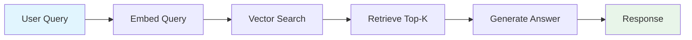

**Why naive RAG breaks:**

**Problem 1: Query-Document Mismatch**

Users ask questions; documents contain statements. The embedding for "What is our vacation policy?" isn't necessarily close to the embedding for "Employees are entitled to 25 days of annual leave." Semantic similarity between questions and answers is weaker than similarity between related statements.

**Problem 2: The "Lost in the Middle" Phenomenon**

When you retrieve 10 chunks and stuff them into the context window, LLMs disproportionately weight content at the beginning and end, often ignoring the middle. If your most relevant chunk lands in position 5 of 10, it may be overlooked. Research from Stanford (2023) showed that accuracy drops by up to 20% for information placed in the middle of long contexts.

**Problem 3: No Quality Signal**

Naive RAG assumes retrieved documents are relevant. If vector search returns garbage, the LLM generates confidently wrong answers. There's no mechanism to detect "I didn't actually find relevant information."

**Problem 4: One-Shot Retrieval**

A single query, a single retrieval pass. Complex questions that require iterating—refining the query based on what you found—get poor results.

```python
"""
RAG Failure Mode Analysis
=========================

This framework helps architects identify which failure modes affect 
their use case and which mitigation patterns to apply.

Each failure mode maps to specific architectural solutions covered
in this tutorial.
"""

# ============================================================
# FAILURE MODE 1: Query-Document Vocabulary Gap
# ============================================================
# 
# Symptom:
#   User Query:      "What's the deal with WFH?"
#   Document Text:   "Remote work policy: Employees may work from home..."
#   Result:          Relevant document not retrieved
#
# Root Cause:
#   Embeddings capture semantic similarity, but acronyms, slang,
#   and domain-specific terms may not map to formal document language.
#   "WFH" and "Remote work" occupy different regions of embedding space.
#
# Solutions (covered in Section 3):
#   - Query expansion: Generate synonyms and related terms
#   - HyDE: Generate hypothetical answer, search with that embedding
#   - Hybrid search: BM25 catches exact term matches dense search misses
#
# Impact: 15-30% of queries affected in enterprise document systems

# ============================================================
# FAILURE MODE 2: Context Position Sensitivity  
# ============================================================
#
# Symptom:
#   Retrieved docs:  [doc1, doc2, doc3, doc4, doc5, doc6, doc7, doc8]
#   LLM attention:   [HIGH, med, low, low, low, low, med, HIGH]
#   Result:          Critical info in positions 3-6 gets ignored
#
# Root Cause:
#   LLMs trained on next-token prediction attend more to recent tokens.
#   In long contexts, middle content receives less attention weight.
#
# Solutions:
#   - Reranking: Put best documents first (Section 3.3)
#   - Fewer chunks: 3-5 high-quality > 10 medium-quality
#   - Hierarchical summarization: Compress context strategically
#
# Impact: 10-20% accuracy degradation in default configurations

# ============================================================
# FAILURE MODE 3: No Relevance Verification
# ============================================================
#
# Symptom:
#   Query:     "What's our policy on AI usage?"
#   Retrieved: [doc about "AI-powered HVAC system maintenance"]
#   Result:    Hallucinated answer about AI policies from HVAC context
#
# Root Cause:
#   Vector similarity matched "AI" keyword but missed semantic intent.
#   No checkpoint verifies retrieved content actually answers the query.
#
# Solutions:
#   - Relevance scoring: Cross-encoder verification before generation
#   - Confidence thresholds: Fallback response when score < threshold
#   - Self-RAG: Model generates retrieval quality tokens
#
# Impact: Primary cause of confident hallucinations in RAG systems

# ============================================================
# FAILURE MODE 4: Single-Pass Retrieval Limitation
# ============================================================
#
# Symptom:
#   Query:     "Compare our parental leave to statutory minimums"
#   Retrieved: [our_policy_doc] -- missing statutory reference
#   Result:    Incomplete or fabricated comparison
#
# Root Cause:
#   Complex queries require multiple retrieval passes or multiple
#   knowledge sources. Single-pass retrieval gets partial information.
#
# Solutions:
#   - Query decomposition: Break into sub-queries, retrieve for each
#   - Iterative retrieval: Retrieve → evaluate → refine → retrieve again
#   - Agentic RAG: Agent decides when more retrieval is needed
#
# Impact: Affects multi-hop questions, comparisons, temporal queries

# ============================================================
# DECISION FRAMEWORK: Matching Failures to Solutions
# ============================================================

FAILURE_SOLUTION_MAP = {
    "vocabulary_gap": {
        "quick_fix": "hybrid_search",      # Add BM25 alongside dense
        "thorough_fix": "hyde_expansion",   # Generate hypothetical docs
        "latency_cost": "200-500ms additional"
    },
    "position_sensitivity": {
        "quick_fix": "reduce_k_to_5",       # Fewer, better chunks
        "thorough_fix": "reranking",        # Cross-encoder reranking
        "latency_cost": "100-300ms additional"
    },
    "no_relevance_check": {
        "quick_fix": "similarity_threshold", # Filter low-score results
        "thorough_fix": "cross_encoder_verification",
        "latency_cost": "200-400ms additional"
    },
    "single_pass_limitation": {
        "quick_fix": "multi_query_expansion",
        "thorough_fix": "agentic_rag",
        "latency_cost": "1-5 seconds additional"
    }
}

# Production recommendation: Start with quick fixes, measure impact,
# add thorough fixes where measurement shows continued problems.
```

### 1.2 Advanced RAG: Pre and Post-Retrieval Optimization

Advanced RAG addresses naive RAG's limitations by adding optimization stages before and after retrieval. Think of it as adding quality gates to a manufacturing process—you catch defects early (pre-retrieval) and verify quality before shipping (post-retrieval).

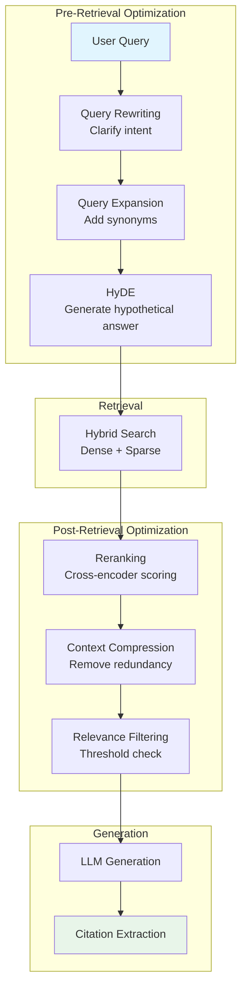

#### Pre-Retrieval Optimizations

**Query Rewriting** transforms the user's query into a form more likely to match relevant documents. Consider a user asking "WFH rules?"—query rewriting might expand this to "remote work policy employee guidelines work from home telecommuting." This bridges the vocabulary gap between casual user language and formal document language.

**Query Expansion** generates multiple related queries from a single input. Instead of searching once, you search for "vacation policy," "annual leave entitlement," "PTO policy," and "holiday allowance," then merge results using Reciprocal Rank Fusion (covered in Section 3.2). This improves recall at the cost of additional latency.

**HyDE (Hypothetical Document Embeddings)** is a counterintuitive but effective technique. Instead of embedding the question and searching for similar documents, you ask the LLM to generate a hypothetical answer, embed *that*, and search for documents similar to the hypothetical answer. This works because answers are semantically closer to documents than questions are.

```python
"""
HyDE: Hypothetical Document Embeddings
======================================

The insight: Questions and answers occupy different semantic spaces.
"What is X?" is semantically distant from "X is defined as..."
But hypothetical answers are close to real answers in embedding space.

Process:
1. User asks: "What's our vacation policy?"
2. LLM generates hypothetical answer (without retrieval)
3. Embed the hypothetical answer
4. Search for documents similar to that embedding
5. Real documents about vacation policy rank higher

Trade-offs:
- Adds 200-500ms (one LLM call for hypothesis generation)
- Works best when there IS relevant content to find
- Can mislead if hypothetical answer is very wrong
- Most effective for factual, non-speculative queries
"""

# Conceptual implementation pattern
HYDE_PROMPT = """
Based on your general knowledge, write a brief passage that would 
answer this question. This is hypothetical - you don't need to be 
certain. Just write what such an answer might look like.

Question: {user_query}

Hypothetical Answer:
"""

# The hypothetical answer becomes the search query
# hypothetical_answer = llm.generate(HYDE_PROMPT.format(user_query=query))
# search_embedding = embed(hypothetical_answer)  # NOT embed(query)
# results = vector_store.search(search_embedding)

# When to use HyDE:
USE_HYDE_WHEN = [
    "Significant vocabulary gap between queries and documents",
    "Users ask questions; documents contain declarative statements",
    "Domain has specialized terminology users might not know",
    "Latency budget allows 200-500ms for hypothesis generation"
]

AVOID_HYDE_WHEN = [
    "Queries are already in document-like language",
    "Latency is critical (<200ms total budget)",
    "Queries are exploratory (no clear expected answer form)",
    "Knowledge base has poor coverage (hypothetical misleads)"
]
```

#### Post-Retrieval Optimizations

**Reranking** is the single highest-impact optimization you can add to a RAG pipeline. Vector search uses bi-encoders (query and documents embedded independently), which are fast but approximate. Reranking uses cross-encoders (query and document processed together through full attention), which are slow but accurate.

The pattern: retrieve top-50 with vector search (fast), rerank to top-5 with cross-encoder (accurate). This gives you the speed of bi-encoders for the initial filter and the accuracy of cross-encoders for final selection.

**Context Compression** reduces retrieved content while preserving relevant information. If you retrieved 5 chunks of 500 tokens each (2,500 tokens), compression might reduce this to 1,000 tokens by removing redundancy and focusing on query-relevant sentences. This saves generation cost and helps the "lost in the middle" problem.

**Relevance Filtering** applies a confidence threshold. If cross-encoder scores all retrieved documents below, say, 0.5, the system can respond "I couldn't find relevant information about that" rather than hallucinating from marginally related content.

```python
"""
Post-Retrieval Optimization Pipeline
====================================

Each stage adds latency but improves quality. Production systems
tune the trade-off based on use case requirements.
"""

# ============================================================
# Stage 1: Reranking
# ============================================================
# 
# Purpose: Re-score documents using more accurate model
# Latency: 100-300ms for 20-50 documents
# Impact: 20-35% improvement in retrieval precision
#
# Model options (quality vs speed trade-off):
#   - Cohere Rerank v3.5: Best quality, API call (~150ms)
#   - Jina Reranker v2: Excellent quality, can self-host (~100ms)
#   - BGE Reranker v2: Very good, local deployment (~80ms)
#   - ms-marco-MiniLM: Good, very fast (~30ms)

RERANKING_CONFIG = {
    "input_count": 50,        # Retrieve 50 candidates
    "output_count": 5,        # Return top 5 after reranking
    "model": "cross-encoder", # Or specific model name
    "timeout_ms": 300         # Fail gracefully if slow
}

# ============================================================
# Stage 2: Context Compression (Optional)
# ============================================================
#
# Purpose: Reduce token count while preserving relevance
# Latency: 100-200ms (LLM-based) or 10-50ms (extractive)
# Impact: 30-50% token reduction, improved "lost in middle"
#
# Approaches:
#   - Extractive: Keep only sentences relevant to query
#   - Abstractive: LLM summarizes each chunk
#   - Hybrid: Extract key sentences, then summarize

COMPRESSION_CONFIG = {
    "target_tokens": 1000,    # Compress to ~1000 tokens
    "method": "extractive",   # Faster, no LLM call
    "preserve_structure": True # Keep document boundaries
}

# ============================================================
# Stage 3: Relevance Filtering
# ============================================================
#
# Purpose: Detect when retrieval failed
# Latency: 0ms (uses reranking scores)
# Impact: Prevents confident hallucinations
#
# Key insight: Better to say "I don't know" than hallucinate

FILTERING_CONFIG = {
    "min_relevance_score": 0.5,  # Threshold (tune per domain)
    "min_documents": 1,           # Need at least 1 above threshold
    "fallback_response": "I couldn't find relevant information. "
                         "Could you rephrase your question?"
}
```

### 1.3 Modular RAG: The LEGO Architecture

The 2024 paper "Modular RAG: Transforming RAG Systems into LEGO-like Reconfigurable Frameworks" formalized what practitioners had discovered: production RAG isn't a fixed pipeline—it's a graph of interchangeable modules.

The key insight is that different queries need different processing paths. A simple factoid query doesn't need HyDE, multi-query expansion, and three reranking passes. A complex analytical query might need all of those plus iterative retrieval. Modular RAG makes these paths configurable.

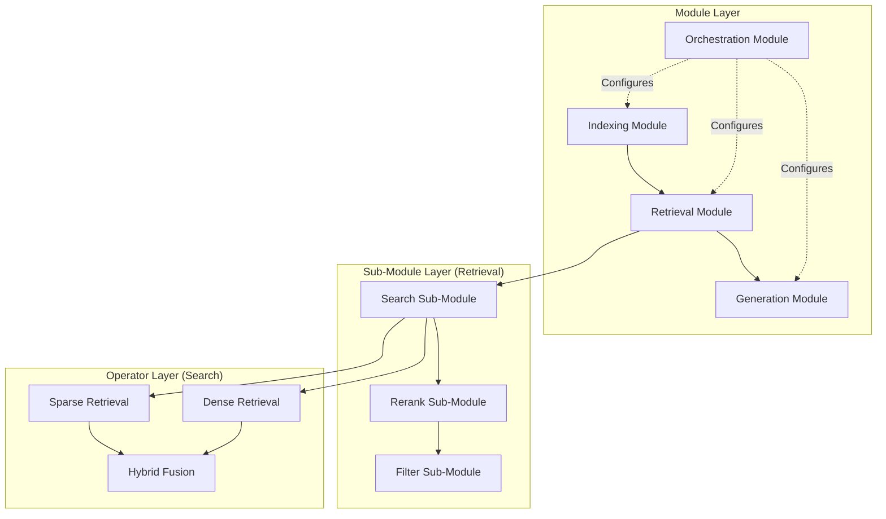

#### The Three-Tier Hierarchy

**Modules** are top-level functional units with stable interfaces. The Retrieval module accepts a query and returns ranked documents—but *how* it does that is encapsulated. You can swap implementations without changing calling code.

**Sub-Modules** are specialized functions within a module. The Retrieval module might contain Search, Rerank, and Filter sub-modules. Each sub-module has its own interface and can be independently configured or replaced.

**Operators** are atomic operations that do one thing. The Search sub-module might use Dense Retrieval, Sparse Retrieval, and Hybrid Fusion operators. Operators are stateless and composable.

#### Why Modularity Matters: The Orchestration Module

The orchestration module enables dynamic behavior that fixed pipelines can't support:

```python
"""
Orchestration Patterns in Modular RAG
=====================================

The orchestration module makes runtime decisions about which
path through the RAG system a query should take.
"""

# ============================================================
# Pattern 1: Query Routing
# ============================================================
#
# Route different query types to different pipelines.
# Simple queries: Fast path (vector search only)
# Complex queries: Full path (HyDE + hybrid + reranking)

ROUTING_RULES = {
    "simple_factoid": {
        # "What is X?" queries with clear expected answer
        "pre_retrieval": [],
        "retrieval": ["dense_search"],
        "post_retrieval": ["top_k_filter"],
        "expected_latency_ms": 200
    },
    "complex_analytical": {
        # Queries requiring synthesis across documents
        "pre_retrieval": ["query_expansion", "hyde"],
        "retrieval": ["hybrid_search"],
        "post_retrieval": ["reranking", "compression"],
        "expected_latency_ms": 1500
    },
    "comparison": {
        # "Compare X to Y" queries needing multiple retrievals
        "pre_retrieval": ["query_decomposition"],
        "retrieval": ["multi_query_retrieval"],
        "post_retrieval": ["dedup", "reranking"],
        "expected_latency_ms": 2000
    }
}

# ============================================================
# Pattern 2: Iterative Retrieval
# ============================================================
#
# If first retrieval doesn't find relevant content,
# reformulate and try again.

ITERATION_CONFIG = {
    "max_iterations": 3,
    "relevance_threshold": 0.6,  # Below this, try again
    "reformulation_strategy": "query_expansion",
    "timeout_ms": 5000  # Total budget across iterations
}

# Pseudo-logic:
# for i in range(max_iterations):
#     results = retrieve(query)
#     if max(results.scores) > relevance_threshold:
#         return results
#     query = reformulate(query, results)  # Learn from what was found
# return results  # Best effort after max iterations

# ============================================================
# Pattern 3: Adaptive Fusion
# ============================================================
#
# Dynamically adjust how dense and sparse results combine
# based on query characteristics.

FUSION_RULES = {
    # Queries with specific identifiers: favor sparse (exact match)
    "has_identifiers": {"dense_weight": 0.3, "sparse_weight": 0.7},
    
    # Conceptual queries: favor dense (semantic match)
    "conceptual": {"dense_weight": 0.8, "sparse_weight": 0.2},
    
    # Default: balanced hybrid
    "default": {"dense_weight": 0.5, "sparse_weight": 0.5}
}
```

### 1.4 Agentic RAG: When Retrieval Becomes Reasoning

Agentic RAG represents a paradigm shift: instead of retrieval being a fixed pipeline stage, it becomes a *tool* that an autonomous agent decides when and how to use.

In traditional RAG, every query triggers retrieval. In agentic RAG, the agent might:
- Answer directly from its training knowledge (no retrieval)
- Retrieve once and answer
- Retrieve, evaluate results, reformulate, retrieve again
- Retrieve from multiple sources and synthesize
- Decide retrieval won't help and ask for clarification

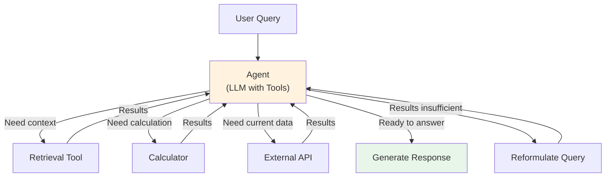

#### Advanced Agentic Patterns

**Self-RAG** (2023) trains the LLM to emit special reflection tokens:
- `[Retrieve]`: Should I retrieve before answering?
- `[IsRel]`: Is this retrieved passage relevant?
- `[IsSup]`: Is my answer supported by the passage?
- `[IsUse]`: Is this response useful?

The model self-critiques at each step, improving both retrieval decisions and answer quality. Available models include `selfrag/selfrag_llama2_7b` and `selfrag/selfrag_llama2_13b`.

**Corrective RAG (CRAG)** adds a document evaluator between retrieval and generation. A lightweight classifier (T5-large, 0.77B parameters) scores each retrieved document as Correct, Ambiguous, or Incorrect. If scores are poor, CRAG triggers query rewriting or web search fallback.

**Graph RAG** (Microsoft, open-sourced April 2024) builds a knowledge graph from documents using LLM-powered entity and relationship extraction. Queries that require understanding relationships between entities—"Who works on projects related to the infrastructure team?"—navigate the graph rather than relying solely on vector similarity.

```python
"""
Agentic RAG Decision Framework
==============================

Agentic RAG adds flexibility but also complexity and latency.
Use this framework to decide if agentic patterns are warranted.
"""

# ============================================================
# When Agentic RAG Adds Value
# ============================================================

USE_AGENTIC_RAG_WHEN = [
    # Multi-step reasoning required
    "Query requires information from multiple retrieval passes",
    "Example: 'Find Q3 revenue, then calculate YoY growth'",
    
    # Conditional logic needed
    "Response depends on what's found",
    "Example: 'If policy changed since 2023, show both versions'",
    
    # Multiple knowledge sources
    "Query spans different document collections or databases",
    "Example: 'Compare our policy to industry standard'",
    
    # Self-correction improves quality
    "Initial retrieval often insufficient",
    "Agent can learn from failed retrievals and retry",
]

# ============================================================
# When Agentic RAG Hurts More Than Helps
# ============================================================

AVOID_AGENTIC_RAG_WHEN = [
    # Latency critical
    "Budget is <1 second total response time",
    "Agentic patterns add 2-10x latency",
    
    # Simple queries dominate
    "Most queries are single-hop factoid lookups",
    "Agent overhead not justified by complexity",
    
    # High volume, low margin
    "Cost per query must be minimized",
    "Agent token usage 3-5x standard RAG",
    
    # Determinism required
    "Responses must be reproducible",
    "Agent decisions introduce variability",
]

# ============================================================
# Agentic Pattern Selection
# ============================================================

PATTERN_SELECTION = {
    "self_rag": {
        "use_when": "Need model to decide if retrieval helps",
        "trade_off": "Requires fine-tuned model",
        "latency_impact": "+500ms for reflection tokens"
    },
    "crag": {
        "use_when": "Document quality varies, need verification",
        "trade_off": "Adds evaluator model inference",
        "latency_impact": "+200-400ms for evaluation"
    },
    "graph_rag": {
        "use_when": "Multi-hop relationship queries",
        "trade_off": "Expensive indexing, complex infrastructure",
        "latency_impact": "+300-800ms for graph traversal"
    },
    "iterative_rag": {
        "use_when": "First retrieval often insufficient",
        "trade_off": "Unpredictable latency (1-5 iterations)",
        "latency_impact": "+500-2000ms per iteration"
    }
}
```

### 1.5 Architecture Selection Decision Framework

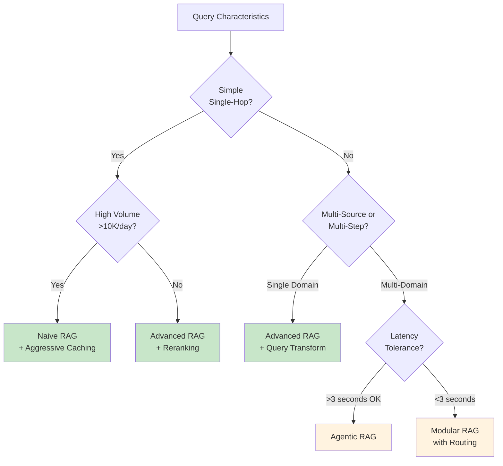

```python
"""
RAG Architecture Selection
==========================

Start with the simplest architecture that meets requirements.
Add complexity only when measurements show problems.
"""

from enum import Enum
from dataclasses import dataclass

class QueryComplexity(Enum):
    SIMPLE = "simple"          # Single fact lookup
    MODERATE = "moderate"      # Requires synthesis across chunks
    COMPLEX = "complex"        # Multi-step reasoning
    AGENTIC = "agentic"        # Requires tool use beyond retrieval

class RAGArchitecture(Enum):
    NAIVE = "naive"            # Tutorial RAG: embed → search → generate
    ADVANCED = "advanced"      # + query transform, reranking, filtering
    MODULAR = "modular"        # + dynamic routing, configurable paths
    AGENTIC = "agentic"        # + autonomous retrieval decisions

@dataclass
class RAGRequirements:
    """
    Capture requirements to select appropriate RAG architecture.
    
    This dataclass helps architects systematically evaluate their
    needs rather than defaulting to complex solutions.
    """
    query_complexity: QueryComplexity
    daily_volume: int
    latency_budget_ms: int
    accuracy_requirement: float  # 0.0-1.0, minimum acceptable
    multi_domain: bool           # Queries span multiple doc collections
    
    def recommended_architecture(self) -> RAGArchitecture:
        """
        Select RAG architecture based on requirements.
        
        Returns the SIMPLEST architecture that meets all constraints.
        This is deliberate—complexity has costs (maintenance, latency,
        debugging difficulty) that should only be paid when necessary.
        """
        # Agentic: Only if complexity demands AND latency allows
        if self.query_complexity == QueryComplexity.AGENTIC:
            if self.latency_budget_ms >= 3000:
                return RAGArchitecture.AGENTIC
            else:
                # Agentic would be ideal but too slow
                return RAGArchitecture.MODULAR
        
        # Complex queries need sophisticated retrieval
        if self.query_complexity == QueryComplexity.COMPLEX:
            if self.multi_domain:
                # Need routing across domains
                return RAGArchitecture.MODULAR
            # Single domain: query transform + rerank usually sufficient
            return RAGArchitecture.ADVANCED
        
        # High volume simple queries: optimize for throughput
        if self.query_complexity == QueryComplexity.SIMPLE:
            if self.daily_volume > 10000:
                # Naive + aggressive caching
                return RAGArchitecture.NAIVE
            # Lower volume: reranking still helps quality
            return RAGArchitecture.ADVANCED
        
        # Moderate complexity: Advanced handles well
        return RAGArchitecture.ADVANCED
    
    def print_recommendation(self):
        """Display recommendation with reasoning."""
        arch = self.recommended_architecture()
        
        reasoning = {
            RAGArchitecture.NAIVE: 
                "High volume + simple queries = optimize for speed. "
                "Add semantic caching for cost efficiency.",
            RAGArchitecture.ADVANCED:
                "Moderate complexity benefits from query transform and "
                "reranking without the overhead of dynamic routing.",
            RAGArchitecture.MODULAR:
                "Multi-domain or complex queries within latency constraints "
                "need intelligent routing between specialized pipelines.",
            RAGArchitecture.AGENTIC:
                "Multi-step reasoning with acceptable latency. Agent can "
                "decide retrieval strategy per query."
        }
        
        print(f"Recommendation: {arch.value.upper()}")
        print(f"Reasoning: {reasoning[arch]}")


# Example usage showing different scenarios
scenarios = [
    ("FAQ Bot (High Volume)", RAGRequirements(
        query_complexity=QueryComplexity.SIMPLE,
        daily_volume=50000,
        latency_budget_ms=500,
        accuracy_requirement=0.85,
        multi_domain=False
    )),
    ("Policy Search (Enterprise)", RAGRequirements(
        query_complexity=QueryComplexity.MODERATE,
        daily_volume=1000,
        latency_budget_ms=2000,
        accuracy_requirement=0.95,
        multi_domain=False
    )),
    ("Research Assistant", RAGRequirements(
        query_complexity=QueryComplexity.COMPLEX,
        daily_volume=500,
        latency_budget_ms=5000,
        accuracy_requirement=0.98,
        multi_domain=True
    )),
]

# Output:
# FAQ Bot (High Volume):
#   Recommendation: NAIVE
#   Reasoning: High volume + simple queries = optimize for speed...
#
# Policy Search (Enterprise):
#   Recommendation: ADVANCED
#   Reasoning: Moderate complexity benefits from query transform...
#
# Research Assistant:
#   Recommendation: MODULAR
#   Reasoning: Multi-domain or complex queries within latency...
```

---

## 2. Document Processing Pipeline

### 2.1 Why Chunking Strategy Matters More Than You Think

Chunking—how you split documents before embedding—has more impact on RAG quality than many architects realize. A 2024 study by Chroma Research found up to **9% recall difference** between chunking strategies on the same dataset.

The intuition: embeddings capture semantic meaning *within a chunk*. If your chunk boundaries break mid-concept, the embedding represents a fragment, not a coherent idea. Retrieved fragments lead to incomplete or confusing context for the LLM.

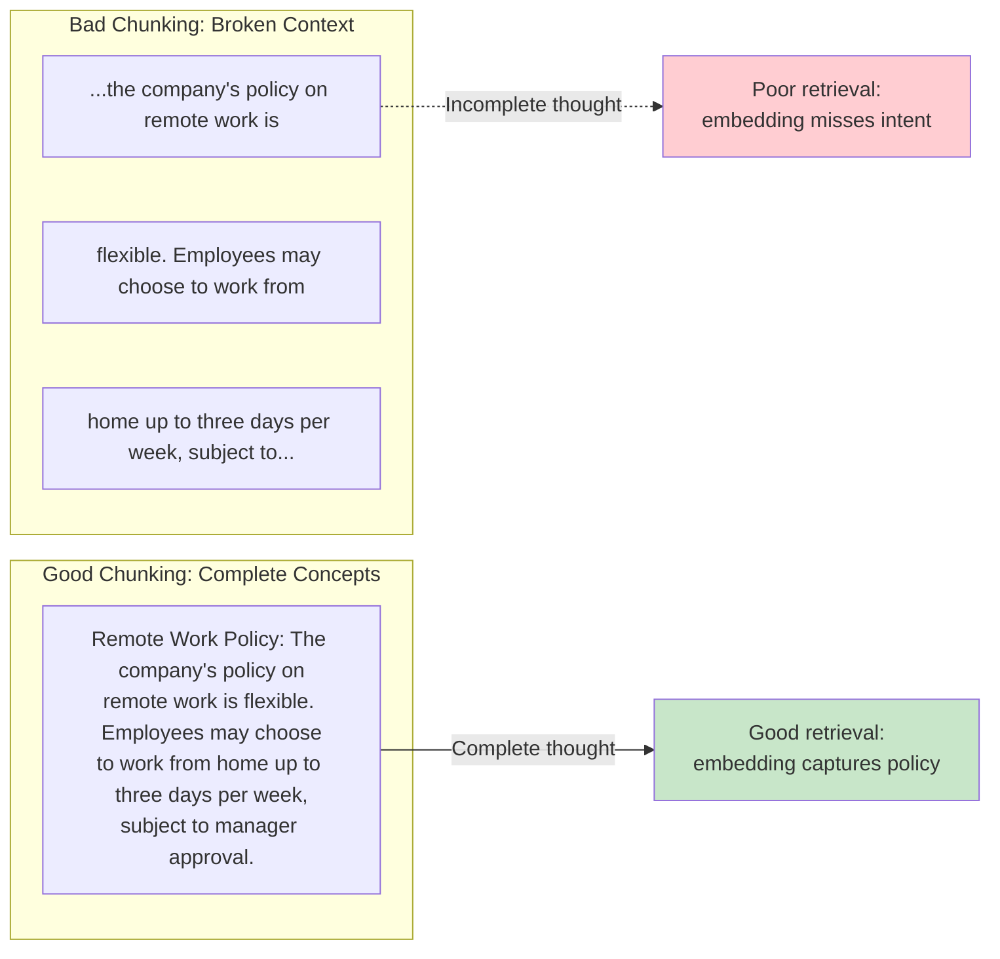

### 2.2 Chunking Strategy Deep Dive

#### Fixed-Size Chunking (Character/Token)

The simplest approach: split every N characters or tokens, optionally with overlap. This is what most tutorials teach because it's easy to implement and explain.

```python
"""
Fixed-Size Chunking Analysis
============================

Fixed-size chunking is the default in tutorials, but has significant
limitations that architects need to understand before choosing it
for production systems.
"""

# ============================================================
# How Fixed-Size Chunking Works
# ============================================================
#
# Parameters:
#   - chunk_size: Number of characters/tokens per chunk
#   - overlap: Characters/tokens shared between adjacent chunks
#
# Algorithm:
#   1. Start at position 0
#   2. Extract chunk_size characters
#   3. Move forward by (chunk_size - overlap)
#   4. Repeat until end of document

# Example with chunk_size=100, overlap=20:
#
# Document: "Remote Work Policy. The company's policy on remote work 
#            is flexible. Employees may choose to work from home up to
#            three days per week, subject to manager approval."
#
# Chunk 1: "Remote Work Policy. The company's policy on remote work is"
# Chunk 2: "k is flexible. Employees may choose to work from home up"
#          ^^^^^ overlap from chunk 1
# Chunk 3: "me up to three days per week, subject to manager approval"
#          ^^^^^ overlap from chunk 2

# ============================================================
# When Fixed-Size Works
# ============================================================

FIXED_SIZE_APPROPRIATE = [
    "Homogeneous content (log files, data records)",
    "Very large documents where precision matters less than coverage",
    "Performance-critical pipelines where sophistication adds latency",
    "Prototyping and initial development"
]

# ============================================================
# When Fixed-Size Fails
# ============================================================

FIXED_SIZE_PROBLEMS = {
    "mid_sentence_breaks": {
        "example": "Chunk ends: '...policy is' | Next chunk: 'flexible...'",
        "impact": "Embedding captures incomplete thought",
        "frequency": "Very common (25-40% of chunks)"
    },
    "mid_paragraph_breaks": {
        "example": "Policy explanation split across 3 chunks",
        "impact": "Context lost, multiple partial matches",
        "frequency": "Common for longer paragraphs"
    },
    "header_content_separation": {
        "example": "Chunk 1: 'Section 5: Benefits' | Chunk 2: content",
        "impact": "Content loses section context",
        "frequency": "Depends on chunk size vs document structure"
    }
}

# ============================================================
# Tuning Fixed-Size Parameters
# ============================================================

TUNING_GUIDANCE = {
    "chunk_size": {
        "too_small_(<200_tokens)": "High overhead, fragments concepts",
        "sweet_spot_(300-500_tokens)": "Balances context and precision",
        "too_large_(>1000_tokens)": "Dilutes relevance signal"
    },
    "overlap": {
        "0_overlap": "Chroma research: often performs best",
        "10-20%_overlap": "Traditional recommendation, prevents hard breaks",
        "high_overlap_(>30%)": "Redundant, storage waste"
    }
}

# Key finding from Chroma Research 2024:
# RecursiveCharacterTextSplitter at 400 tokens with 0 overlap
# achieved 89.5% recall with text-embedding-3-large,
# outperforming semantic chunking (88.2%) and other approaches.
```

#### Recursive Character Text Splitting

The recursive approach attempts splits at natural boundaries before falling back to character-level splits. It tries paragraph breaks first, then sentences, then words, then characters.

```python
"""
Recursive Character Text Splitting
==================================

The most practical improvement over fixed-size for most use cases.
Available in LangChain as RecursiveCharacterTextSplitter.
"""

# ============================================================
# The Recursive Strategy
# ============================================================
#
# Priority order of split attempts:
#
#   1. "\n\n" - Paragraph breaks (ideal: complete thoughts)
#   2. "\n"   - Line breaks (good: logical divisions)
#   3. ". "   - Sentences (acceptable: complete statements)
#   4. ", "   - Clauses (degraded: partial statements)
#   5. " "    - Words (poor: broken context)
#   6. ""     - Characters (last resort)
#
# Algorithm:
#   1. Try to split document at highest-priority separator
#   2. For each resulting chunk:
#      a. If chunk <= chunk_size: keep it
#      b. If chunk > chunk_size: recursively split with next separator
#   3. Continue until all chunks fit within chunk_size

# ============================================================
# Why Recursive Works Well
# ============================================================
#
# Key insight: Most well-written text naturally breaks at paragraph
# and sentence boundaries. The recursive approach exploits this.
#
# In practice:
#   - 60-70% of chunks split at paragraph level
#   - 20-25% split at sentence level
#   - 5-10% need deeper recursion
#   - <5% hit character-level splitting

# ============================================================
# Configuration Pattern
# ============================================================

RECURSIVE_CONFIG = {
    "chunk_size": 400,        # Tokens (not characters)
    "chunk_overlap": 0,       # Chroma research: 0 often best
    "separators": [
        "\n\n",               # Paragraph breaks
        "\n",                 # Line breaks
        ". ",                 # Sentences
        "? ",                 # Questions
        "! ",                 # Exclamations
        "; ",                 # Clauses
        ", ",                 # Phrases
        " ",                  # Words
        ""                    # Characters (last resort)
    ],
    "length_function": "token_count",  # Not character count
}

# ============================================================
# Benchmark Results (Chroma Research, 2024)
# ============================================================
#
# Dataset: Mixed document corpus
# Embedding: text-embedding-3-large
# Metric: Recall@10
#
# Strategy                      Recall@10
# -------------------------------------------
# Recursive (400 tokens, 0 overlap)   89.5%
# Semantic (embedding-based)          88.2%
# Fixed (400 tokens)                  86.1%
# Fixed (200 tokens)                  87.3%
#
# Key finding: Simpler recursive approach outperformed more
# sophisticated semantic chunking on this benchmark.
```

#### Semantic Chunking

Semantic chunking uses embeddings to detect topic boundaries. Instead of splitting at fixed intervals or syntactic markers, it measures semantic similarity between adjacent sentences and creates chunk boundaries where similarity drops significantly.

```python
"""
Semantic Chunking
=================

Split text based on semantic similarity between adjacent sentences.
When similarity drops below threshold → new chunk boundary.
"""

# ============================================================
# The Algorithm
# ============================================================
#
# 1. Split document into sentences
# 2. Embed each sentence
# 3. Compute cosine similarity between adjacent sentence pairs
# 4. Where similarity drops below threshold → create chunk boundary
# 5. Group sentences between boundaries into chunks
#
# Typical threshold range: 0.7 - 0.8 (tune per domain)

# ============================================================
# Trade-offs
# ============================================================
#
# Pro:  Topic-aware boundaries produce more coherent chunks
# Con:  Requires embedding every sentence at index time (slower, costlier)
# Con:  Threshold tuning needed per domain

# ============================================================
# When to Use Semantic Chunking
# ============================================================
#
# Good for:
# - Documents with clear topic shifts (articles, reports, manuals)
# - When chunk coherence matters more than indexing speed
# - Low-volume, high-value document collections
#
# Avoid when:
# - High-volume indexing (embedding cost per sentence adds up)
# - Highly structured docs (use hierarchical chunking instead)
# - Benchmarks show recursive is good enough (see Chroma Research above)

# ============================================================
# Semantic Chunking vs Late Chunking
# ============================================================
#
# These solve DIFFERENT problems and can be combined:
#
#   Aspect          Semantic Chunking         Late Chunking
#   ----------------------------------------------------------------
#   Question        "Where should I cut?"     "How should I embed?"
#   Method          Similarity-based splits   Full-doc context embedding
#   Solves          Topic fragmentation       Cross-reference loss
#   Cost            Extra embeddings/sentence Same as traditional
#
# You could use semantic chunking to find boundaries,
# then late chunking to embed with full document context.
```

### 2.3 Late Chunking: The 2024 Breakthrough

Traditional chunking has a fundamental problem: each chunk is embedded independently, losing document-level context. Consider a chunk that says "The policy was updated in Q3"—without knowing which policy, from which document, this embedding is nearly useless.

**Late Chunking**, introduced by Jina AI (September 2024), reverses the order: **embed first, chunk later**.

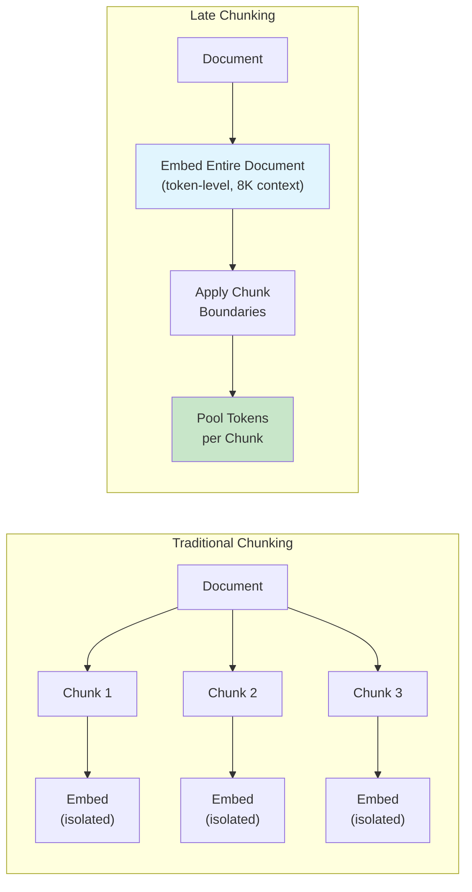

#### How Late Chunking Works

```python
"""
Late Chunking: Embed First, Chunk Later
=======================================

The most significant chunking innovation of 2024, introduced
by Jina AI. Solves the context isolation problem in traditional
chunking without the cost of contextual retrieval.
"""

# ============================================================
# The Traditional Chunking Problem
# ============================================================
#
# Document: "Acme Corp's remote work policy was updated in Q3 2024.
#            The policy now allows 4 days WFH per week."
#
# Traditional chunking might create:
#   Chunk 1: "Acme Corp's remote work policy was updated in Q3 2024."
#   Chunk 2: "The policy now allows 4 days WFH per week."
#
# When Chunk 2 is embedded INDEPENDENTLY:
#   - "The policy" is ambiguous (which policy? which company?)
#   - The embedding loses critical context
#   - Retrieval quality suffers

# ============================================================
# Late Chunking Solution
# ============================================================
#
# Step 1: Pass ENTIRE document through long-context embedding model
#         Every token gets an embedding that "sees" the full document
#         via bidirectional attention.
#
# Step 2: Define chunk boundaries (same as traditional chunking)
#
# Step 3: For each chunk, mean-pool the token embeddings within it
#         These tokens ALREADY incorporate full document context
#
# Result: Chunk 2's embedding includes context from Chunk 1
#         "The policy" tokens know they refer to Acme Corp's remote work policy

# ============================================================
# Requirements
# ============================================================

LATE_CHUNKING_REQUIREMENTS = {
    "embedding_model": {
        "context_length": "8K+ tokens (must fit entire document)",
        "pooling_method": "mean pooling (NOT CLS token)",
        "architecture": "Bidirectional attention"
    },
    "supported_models": [
        "jina-embeddings-v2",
        "jina-embeddings-v3",
        "jina-embeddings-v4",
        "nomic-embed-text-v1",
    ],
    "not_supported": [
        "Models with CLS pooling",
        "Models with <512 token context",
        "Decoder-only embeddings"
    ]
}

# ============================================================
# Benchmark Results (Jina AI, September 2024)
# ============================================================

BENCHMARK_RESULTS = {
    "nfcorpus": {
        "traditional": 23.5,
        "late_chunking": 30.0,
        "improvement": "+27.7%"
    },
    "scifact": {
        "traditional": 64.2,
        "late_chunking": 66.1,
        "improvement": "+3.0%"
    },
    "scifact_with_jina_v3": {
        "traditional": 64.2,
        "late_chunking": 73.2,
        "improvement": "+14.0%"
    }
}

# ============================================================
# Cost Comparison
# ============================================================

COST_COMPARISON = {
    "late_chunking": {
        "per_million_tokens": "$0.05 (embedding API)",
        "llm_calls": "None",
        "description": "One embedding call per document"
    },
    "contextual_retrieval": {
        "per_million_tokens": "$1.02 (with prompt caching)",
        "llm_calls": "One per chunk for context generation",
        "description": "LLM enriches each chunk"
    }
}

# Key insight: Late chunking achieves comparable quality to
# Anthropic's contextual retrieval at ~5% of the cost.

# ============================================================
# When to Use Late Chunking
# ============================================================

USE_LATE_CHUNKING_WHEN = [
    "Documents fit within model context (< 8K tokens)",
    "Cross-chunk context matters (pronouns, references)",
    "Cost is a concern (vs contextual retrieval)",
    "Using a supported embedding model"
]

AVOID_LATE_CHUNKING_WHEN = [
    "Documents exceed context length",
    "Using unsupported embedding models",
    "Chunks are naturally self-contained",
    "Need maximum quality (use contextual retrieval instead)"
]
```

### 2.4 Contextual Retrieval: Maximum Quality at Higher Cost

Anthropic's **Contextual Retrieval** (September 2024) takes a different approach: use an LLM to enrich each chunk with explanatory context before embedding.

```python
"""
Contextual Retrieval: LLM-Enriched Chunks
=========================================

When retrieval quality is paramount and indexing cost is acceptable,
contextual retrieval provides the highest quality chunking approach.
"""

# ============================================================
# How Contextual Retrieval Works
# ============================================================
#
# For each chunk, call an LLM with:
#   1. The full document (for context)
#   2. The specific chunk (to contextualize)
#
# LLM generates a contextual preamble that situates the chunk
# within the broader document.

CONTEXTUAL_PROMPT = """
<document>
{whole_document}
</document>

Here is the chunk we want to situate within the document:
<chunk>
{chunk_content}
</chunk>

Please give a short succinct context to situate this chunk 
within the overall document for the purposes of improving 
search retrieval of the chunk. Answer only with the succinct 
context and nothing else.
"""

# ============================================================
# Example Transformation
# ============================================================
#
# Original Chunk:
#   "The policy was updated in Q3 2024 to allow 4 days WFH."
#
# Contextual Preamble Generated:
#   "This chunk is from Acme Corp's Employee Handbook, specifically 
#    the Remote Work Policy section. The previous version allowed 
#    3 days WFH, and this update increased it to 4 days."
#
# Final Contextualized Chunk (for embedding):
#   "This chunk is from Acme Corp's Employee Handbook, specifically 
#    the Remote Work Policy section. The previous version allowed 
#    3 days WFH, and this update increased it to 4 days.
#    
#    The policy was updated in Q3 2024 to allow 4 days WFH."

# ============================================================
# Results (Anthropic, September 2024)
# ============================================================

RESULTS = {
    "contextual_embeddings_only": {
        "improvement": "-35% retrieval failures",
        "description": "Just adding context to chunks"
    },
    "plus_contextual_bm25": {
        "improvement": "-49% retrieval failures", 
        "description": "Context helps both dense and sparse"
    },
    "plus_reranking": {
        "improvement": "-67% retrieval failures",
        "description": "Full pipeline: context + hybrid + rerank"
    }
}

# ============================================================
# Cost Analysis
# ============================================================
#
# Cost is dominated by the LLM call per chunk.
# With prompt caching (Claude), the document is cached and
# only the chunk-specific prompt is charged at full price.

COST_CALCULATION = {
    "per_million_doc_tokens": "$1.02",  # With prompt caching
    "breakdown": {
        "document_context": "Cached after first chunk",
        "chunk_prompt": "~50-100 tokens per chunk",
        "context_generation": "~50-100 tokens output per chunk"
    },
    "one_time_cost": True,  # Indexing, not per-query
}

# ============================================================
# When to Use Contextual Retrieval
# ============================================================

USE_CONTEXTUAL_WHEN = [
    "High-value documents (legal, medical, compliance)",
    "Retrieval accuracy is critical",
    "Document set is relatively small (<100K chunks)",
    "Can afford $1/million tokens indexing cost",
    "Documents have complex cross-references"
]

AVOID_CONTEXTUAL_WHEN = [
    "Large document sets (millions of chunks)",
    "Cost is primary constraint",
    "Documents are self-contained (each chunk complete)",
    "Late chunking achieves sufficient quality"
]
```

### 2.5 Chunking Decision Framework

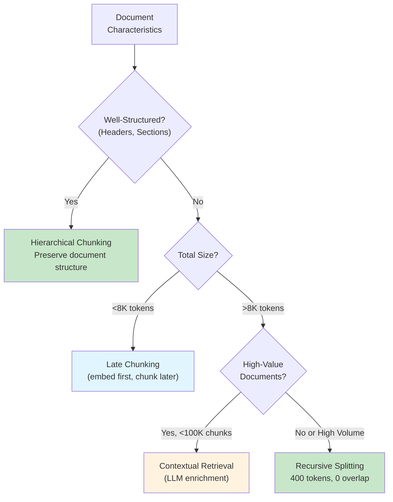

```python
"""
Chunking Strategy Selection
===========================

Use this decision framework to select the appropriate chunking
strategy based on document characteristics and requirements.
"""

from enum import Enum
from dataclasses import dataclass

class ChunkingStrategy(Enum):
    FIXED = "fixed_size"                # Simple, fast, baseline
    RECURSIVE = "recursive"             # Better boundaries
    HIERARCHICAL = "hierarchical"       # Preserves structure
    SEMANTIC = "semantic"               # Embedding-based boundaries
    LATE = "late_chunking"              # Embed first, chunk later
    CONTEXTUAL = "contextual_retrieval" # LLM-enriched chunks

@dataclass
class DocumentProfile:
    """Profile a document to select optimal chunking strategy."""
    has_structure: bool          # Headers, sections, clear organization
    total_tokens: int            # Document length
    high_value: bool             # Legal, medical, compliance docs
    chunk_count_estimate: int    # Expected number of chunks
    indexing_budget_per_doc: float  # Cost tolerance in dollars

def select_chunking_strategy(profile: DocumentProfile) -> ChunkingStrategy:
    """
    Select optimal chunking strategy based on document characteristics.
    
    Priority order:
    1. Structure-aware if document is well-structured
    2. Late chunking if document fits in context window
    3. Contextual retrieval if high-value and budget allows
    4. Recursive as reliable default
    """
    
    # Well-structured documents: preserve that structure
    if profile.has_structure:
        return ChunkingStrategy.HIERARCHICAL
    
    # Small documents: late chunking captures full context
    if profile.total_tokens < 8000:
        return ChunkingStrategy.LATE
    
    # High-value documents: invest in maximum quality
    if profile.high_value and profile.chunk_count_estimate < 100000:
        if profile.indexing_budget_per_doc >= 0.001:  # ~$1 per 1000 docs
            return ChunkingStrategy.CONTEXTUAL
    
    # Default: recursive with proven settings
    return ChunkingStrategy.RECURSIVE


# ============================================================
# Example Scenarios
# ============================================================

SCENARIOS = {
    "hr_policy_handbook": {
        "profile": {
            "has_structure": True,   # Clear sections: Benefits, Leave, etc.
            "total_tokens": 5000,
            "high_value": True,
            "chunk_count_estimate": 20,
            "indexing_budget_per_doc": 0.01
        },
        "recommendation": "HIERARCHICAL",
        "reasoning": "Clear document structure should be preserved. "
                     "Section headers provide important context."
    },
    "legal_contract": {
        "profile": {
            "has_structure": False,  # Dense prose, few headers
            "total_tokens": 15000,
            "high_value": True,      # Legal accuracy critical
            "chunk_count_estimate": 50,
            "indexing_budget_per_doc": 0.05
        },
        "recommendation": "CONTEXTUAL_RETRIEVAL",
        "reasoning": "High-value document where accuracy matters more "
                     "than indexing cost. LLM enrichment worth investment."
    },
    "product_reviews_bulk": {
        "profile": {
            "has_structure": False,
            "total_tokens": 500,     # Short reviews
            "high_value": False,
            "chunk_count_estimate": 1000000,
            "indexing_budget_per_doc": 0.0001
        },
        "recommendation": "RECURSIVE",
        "reasoning": "High volume, low per-document value. "
                     "Need efficient processing, not maximum quality."
    },
    "technical_documentation": {
        "profile": {
            "has_structure": True,   # API docs with headers
            "total_tokens": 3000,
            "high_value": False,
            "chunk_count_estimate": 15,
            "indexing_budget_per_doc": 0.001
        },
        "recommendation": "LATE_CHUNKING",
        "reasoning": "Fits in context window, cross-references between "
                     "sections matter, structure partly preserved."
    }
}
```

---

## 3. Retrieval Engineering

### 3.1 The Dense-Sparse Spectrum

Retrieval isn't a binary choice—it's a spectrum from pure keyword matching to pure semantic similarity. Production systems often combine both to capture different types of relevance.

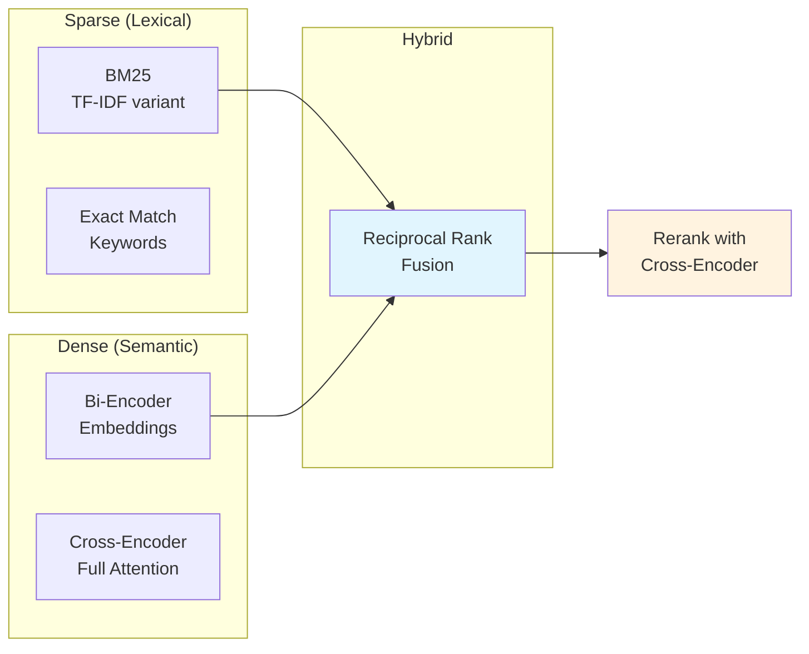

#### Dense Retrieval (Embeddings)

**Bi-encoders** encode query and documents independently into the same vector space. Retrieval is a nearest-neighbor search in that space. This captures semantic similarity—"car" matches "automobile"—but misses lexical precision.

**How it works:** The query is embedded once. Documents are embedded at indexing time. At query time, we find documents whose embeddings are closest to the query embedding (typically using cosine similarity or dot product).

**Strengths:** Captures meaning, handles synonyms, works well for conceptual queries.

**Weaknesses:** Misses exact matches, computationally expensive to embed, embedding quality depends on model training data.

#### Sparse Retrieval (BM25)

**BM25** (Best Matching 25) is the standard for lexical search. It weights terms by frequency in the document (TF) and rarity across the corpus (IDF). Common words like "the" contribute little; rare domain terms contribute heavily.

**How it works:** Build an inverted index mapping terms to documents. At query time, look up query terms and score documents by term frequency and inverse document frequency.

**Strengths:** Exact match precision, fast (inverted index), handles rare terms well.

**Weaknesses:** No semantic understanding, misses synonyms, vocabulary mismatch hurts.

```python
"""
When Sparse Beats Dense: Know Your Failure Modes
================================================

Many architects over-rely on embeddings when BM25 would work better.
Understanding when sparse retrieval wins helps design better hybrids.
"""

# ============================================================
# Scenario 1: Technical Identifiers
# ============================================================
#
# Query:    "Error code TS-7492"
# 
# BM25:     "TS-7492" is rare (high IDF), exact match → correct document
# Dense:    "TS-7492" has no semantic meaning in embedding space
#           Model never saw this identifier in training
#           Embedding is essentially random → poor retrieval
#
# Winner:   BM25 by a wide margin

# ============================================================
# Scenario 2: Proper Nouns
# ============================================================
#
# Query:    "Dr. Elisabeth Thornberg's publications on neural plasticity"
#
# BM25:     Matches "Elisabeth Thornberg" exactly
# Dense:    Name might embed near other researchers
#           "Elisabeth" could be confused with other Elisabeths
#
# Winner:   BM25 for name precision, dense for topic relevance
#           Hybrid captures both

# ============================================================
# Scenario 3: Rare Technical Terms
# ============================================================
#
# Query:    "HNSW algorithm parameters for high-dimensional vectors"
#
# BM25:     "HNSW" is rare term, high IDF, strong signal
# Dense:    If embedding model wasn't trained on HNSW content,
#           the embedding quality for this term is poor
#
# Winner:   BM25 for the rare term, dense for "algorithm parameters"
#           Hybrid combines both signals

# ============================================================
# Scenario 4: Negation
# ============================================================
#
# Query:    "policies that do NOT apply to contractors"
#
# BM25:     Matches documents containing "NOT", "contractors"
#           Boolean logic possible with more sophisticated sparse
# Dense:    Negation semantics are notoriously difficult
#           "NOT apply to contractors" might embed similarly to
#           "apply to contractors" (negation lost)
#
# Winner:   Neither handles this well alone
#           Best approach: query transformation + reranking

# ============================================================
# Production Insight
# ============================================================
#
# Query characteristics that favor BM25:
#   - Contains product codes, error IDs, SKUs
#   - Contains proper nouns (people, companies, places)
#   - Uses domain-specific abbreviations
#   - Requires exact phrase matching
#
# Default recommendation: Always use hybrid search.
# The incremental cost is low (~100-200ms), and it catches
# cases where either approach alone would fail.

SPARSE_DOMINANT_SIGNALS = [
    "alphanumeric_identifiers",    # TS-7492, SKU-12345
    "proper_nouns",                # Dr. Smith, Acme Corp
    "rare_technical_terms",        # HNSW, FAISS, pgvector
    "quoted_exact_phrases",        # "annual leave policy"
    "version_numbers",             # v2.3.1, Python 3.12
]

DENSE_DOMINANT_SIGNALS = [
    "conceptual_queries",          # "how to improve performance"
    "synonym_variation",           # "car" should match "automobile"
    "paraphrased_questions",       # Different wording, same meaning
    "exploratory_search",          # "topics related to X"
]
```

### 3.2 Hybrid Search and Reciprocal Rank Fusion

Hybrid search combines dense and sparse retrieval, merging their result lists. The challenge: results from different systems have incompatible scores. A BM25 score of 12.5 means nothing compared to a cosine similarity of 0.85.

**Reciprocal Rank Fusion (RRF)** solves this elegantly by focusing on *rank*, not score. Documents that appear near the top of multiple lists get high combined scores.

```python
"""
Reciprocal Rank Fusion (RRF)
============================

The standard algorithm for merging ranked lists from different
retrieval systems. Elegant, effective, and simple to implement.
"""

# ============================================================
# The RRF Formula
# ============================================================
#
# For a document d appearing in result lists R₁, R₂, ..., Rₙ:
#
#   RRF(d) = Σ  1 / (k + rank_r(d))
#            r
#
# Where:
#   - r iterates over all ranking systems
#   - rank_r(d) is d's position in system r (0-indexed)
#   - k is a constant (default 60)
#
# Key properties:
#   - Rank 1 (position 0) contributes 1/(k+0) = 1/60 ≈ 0.0167
#   - Rank 10 (position 9) contributes 1/(k+9) = 1/69 ≈ 0.0145
#   - Documents in multiple lists accumulate scores

# ============================================================
# Implementation
# ============================================================

def reciprocal_rank_fusion(
    result_lists: list[list[dict]], 
    k: int = 60
) -> list[dict]:
    """
    Merge multiple ranked result lists using RRF.
    
    Args:
        result_lists: List of ranked document lists from different systems.
                      Each document must have an 'id' field.
        k: Ranking constant. Default 60 per original paper.
           Higher k = less penalty for lower ranks.
    
    Returns:
        Merged list sorted by RRF score (highest first).
    
    Why k=60?
        The original RRF paper (Cormack et al., 2009) tested values
        from 20 to 100 and found k=60 provided stable results across
        diverse datasets. Lower k penalizes lower ranks more heavily;
        higher k treats all ranks more equally.
    """
    score_dict = {}
    
    for results in result_lists:
        for rank, doc in enumerate(results):
            doc_id = doc.get('id', str(doc))
            
            if doc_id not in score_dict:
                score_dict[doc_id] = {
                    'doc': doc,
                    'score': 0.0,
                    'appearances': []
                }
            
            # Add RRF contribution from this ranking
            score_dict[doc_id]['score'] += 1.0 / (k + rank)
            score_dict[doc_id]['appearances'].append({
                'system': len(score_dict[doc_id]['appearances']),
                'rank': rank
            })
    
    # Sort by score descending
    merged = sorted(
        score_dict.values(),
        key=lambda x: x['score'],
        reverse=True
    )
    
    return merged


# ============================================================
# Example Walkthrough
# ============================================================

"""
Dense Results:  [doc_A(1), doc_C(2), doc_B(3), doc_D(4)]
Sparse Results: [doc_B(1), doc_A(2), doc_D(3), doc_E(4)]

RRF Calculation (k=60):

doc_A: Dense rank 0 + Sparse rank 1
       = 1/(60+0) + 1/(60+1) 
       = 0.01667 + 0.01639 
       = 0.03306

doc_B: Dense rank 2 + Sparse rank 0
       = 1/(60+2) + 1/(60+0)
       = 0.01613 + 0.01667
       = 0.03280

doc_C: Dense rank 1 only
       = 1/(60+1)
       = 0.01639

doc_D: Dense rank 3 + Sparse rank 2
       = 1/(60+3) + 1/(60+2)
       = 0.01587 + 0.01613
       = 0.03200

doc_E: Sparse rank 3 only
       = 1/(60+3)
       = 0.01587

Final Ranking: doc_A (0.033) > doc_B (0.033) > doc_D (0.032) > doc_C (0.016) > doc_E (0.016)

Note: doc_A slightly beats doc_B because its higher dense rank
      (position 0 vs 2) contributes more than doc_B's higher sparse rank.
"""

# ============================================================
# Tuning Hybrid Search
# ============================================================

HYBRID_TUNING = {
    "k_parameter": {
        "lower_(20-40)": "More emphasis on top ranks, sharp cutoff",
        "default_(60)": "Balanced, recommended starting point",
        "higher_(80-100)": "More equal treatment of all ranks"
    },
    "sparse_boost": {
        "description": "Multiply sparse scores before fusion",
        "when_to_increase": "Queries often contain exact identifiers",
        "typical_value": "1.0-1.5",
        "example": "sparse_results weighted 1.2x before RRF"
    },
    "dense_boost": {
        "description": "Multiply dense scores before fusion",
        "when_to_increase": "Queries are conceptual, few exact terms",
        "typical_value": "1.0-1.5"
    }
}

# AIMultiple 2024 benchmark finding:
# Well-tuned hybrid search achieved +18.5% MRR improvement over dense-only.
# But "well-tuned" is key—naive combination can underperform either alone.
```

### 3.3 Reranking: The Quality Multiplier

Reranking is the single highest-impact optimization you can add to a RAG pipeline. The reason comes down to encoder architecture.

**Bi-encoders** (used in vector search) embed query and documents independently. The query embedding is computed without seeing any document; each document embedding is computed without seeing the query. This is fast—you compute the query embedding once and compare against pre-computed document embeddings—but it's inherently limited. The embeddings must be general enough to work for any query.

**Cross-encoders** process query and document *together* through full transformer attention. Every token in the query can attend to every token in the document. This is slow—you need one forward pass per (query, document) pair—but dramatically more accurate.

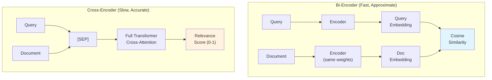

```python
"""
Two-Stage Retrieval with Reranking
==================================

The dominant pattern in production RAG systems.
Fast bi-encoder for candidate generation, accurate cross-encoder for selection.
"""

# ============================================================
# The Two-Stage Pattern
# ============================================================
#
# Stage 1: Candidate Generation (Bi-Encoder)
# ------------------------------------------
# Method:     Vector similarity search
# Documents:  Retrieve top-50 candidates from corpus
# Speed:      <100ms even for millions of documents
# Accuracy:   ~70-80% of optimal (good recall, imperfect precision)
#
# Stage 2: Reranking (Cross-Encoder)
# ----------------------------------
# Method:     Score each (query, document) pair
# Documents:  Rerank 50 candidates → select top-5
# Speed:      200-500ms for 50 documents
# Accuracy:   ~95%+ of optimal

# ============================================================
# Why This Works
# ============================================================
#
# Cross-encoder is O(n) per document—scoring all documents in a
# large corpus would take hours. But O(n) for 50 documents is
# perfectly acceptable.
#
# Bi-encoder quickly filters millions of documents to a manageable
# candidate set. Cross-encoder then applies accurate scoring to
# this small set.
#
# The combination achieves near cross-encoder quality at near
# bi-encoder speed.

# ============================================================
# Reranking Impact (Benchmarks)
# ============================================================

RERANKING_IMPACT = {
    "anthropic_benchmarks": {
        "reranking_alone": "-35% retrieval failures",
        "with_hybrid_search": "-49% retrieval failures",
        "with_contextual_embeddings": "-67% retrieval failures"
    },
    "latency_overhead": {
        "50_documents": "200-500ms",
        "100_documents": "400-1000ms",
        "typical_config": "Rerank top-50 to get top-5"
    }
}

# ============================================================
# Reranker Model Selection
# ============================================================

RERANKER_MODELS = {
    "cohere_rerank_v3.5": {
        "quality": "Best in class (as of Dec 2024)",
        "deployment": "API only",
        "latency": "~150ms for 50 docs",
        "cost": "Pay per request",
        "best_for": "Production systems prioritizing quality"
    },
    "jina_reranker_v2": {
        "quality": "Excellent",
        "deployment": "API or self-hosted",
        "latency": "~100ms for 50 docs",
        "cost": "API or infrastructure",
        "best_for": "Balance of quality and control"
    },
    "bge_reranker_v2": {
        "quality": "Very good",
        "deployment": "Self-hosted only",
        "latency": "~80ms for 50 docs",
        "cost": "Infrastructure only",
        "best_for": "Data residency requirements"
    },
    "ms_marco_minilm": {
        "quality": "Good (baseline)",
        "deployment": "Self-hosted only",
        "latency": "~30ms for 50 docs",
        "cost": "Infrastructure only",
        "best_for": "Latency-critical applications"
    }
}

# ============================================================
# Configuration Pattern
# ============================================================

RERANKING_CONFIG = {
    "candidate_count": 50,        # Retrieve this many initially
    "output_count": 5,            # Return this many after reranking
    "min_score_threshold": 0.5,   # Filter out low-confidence results
    "timeout_ms": 500,            # Fail gracefully if slow
    "fallback_on_timeout": True   # Return unreranked results if timeout
}

# Production recommendation:
# 1. Start with Cohere Rerank for quality
# 2. Measure latency impact in your environment
# 3. If data residency matters, evaluate self-hosted options
# 4. If latency critical, try ms-marco-MiniLM
```

### 3.4 Query Transformation Techniques

When users' query vocabulary doesn't match document vocabulary, transformation techniques bridge the gap.

#### Multi-Query Expansion

Generate multiple semantically related queries, retrieve for each, merge results.

```python
"""
Multi-Query Expansion
=====================

Generate variations of the user's query to improve recall.
Different phrasings may retrieve different relevant documents.
"""

# ============================================================
# How It Works
# ============================================================
#
# User Query: "work from home policy"
#
# LLM generates related queries:
#   1. "remote work guidelines for employees"
#   2. "WFH eligibility requirements"
#   3. "telecommuting policy company"
#   4. "hybrid work arrangement rules"
#
# Retrieval runs for each query:
#   Query 1 → [doc_a, doc_c, doc_f]
#   Query 2 → [doc_b, doc_a, doc_d]
#   Query 3 → [doc_a, doc_e, doc_b]
#   Query 4 → [doc_c, doc_a, doc_g]
#
# Merge with RRF:
#   doc_a appears in 4/4 lists → highest score
#   doc_c appears in 2/4 lists → second tier
#   doc_b appears in 2/4 lists → second tier
#   etc.

MULTI_QUERY_PROMPT = """
Generate 4 alternative search queries for the following question.
Each query should approach the topic from a different angle or use
different terminology that might appear in relevant documents.

Original question: {user_query}

Alternative queries (one per line):
"""

# ============================================================
# Configuration
# ============================================================

MULTI_QUERY_CONFIG = {
    "num_queries": 4,            # Generate this many alternatives
    "include_original": True,    # Also search with original query
    "retrieval_k": 10,           # Retrieve 10 per query
    "final_k": 10,               # Return 10 after merging
    "merge_method": "rrf",       # Reciprocal Rank Fusion
}

# ============================================================
# Trade-offs
# ============================================================

TRADE_OFFS = {
    "benefits": [
        "Improves recall by 15-30% in benchmarks",
        "Handles vocabulary mismatch",
        "Catches relevant docs that exact query misses"
    ],
    "costs": [
        "+200-500ms for LLM query generation",
        "+N × retrieval_latency (can parallelize)",
        "May retrieve irrelevant docs if generated queries drift"
    ],
    "when_to_use": [
        "User queries are often ambiguous or informal",
        "Documents use formal/technical language",
        "Recall more important than precision",
        "Latency budget allows extra LLM call"
    ]
}
```

#### HyDE: Hypothetical Document Embeddings

Instead of searching with the question embedding, generate a hypothetical answer and search with that.

```python
"""
HyDE: Hypothetical Document Embeddings
======================================

Bridge the semantic gap between questions and documents by
searching with a hypothetical answer instead of the question.
"""

# ============================================================
# The Intuition
# ============================================================
#
# Questions and statements occupy different semantic regions:
#   "What is the capital of France?" → question embedding
#   "Paris is the capital of France." → statement embedding
#
# Documents contain statements, not questions.
# A hypothetical answer is semantically closer to real documents
# than the question itself.

# ============================================================
# Process
# ============================================================
#
# Step 1: Generate hypothetical answer (without retrieval)
#
#   Query: "What's our policy on unused vacation days?"
#   
#   Hypothetical: "The company's policy allows employees to carry
#   over up to 5 unused vacation days to the following year. Days
#   beyond 5 expire unless special approval is obtained."
#
# Step 2: Embed the hypothetical answer (NOT the query)
#
# Step 3: Search for documents similar to the hypothetical
#
# The search now finds documents about vacation carryover policies,
# even if they don't contain the word "unused" or phrase the
# concept the same way as the original query.

HYDE_PROMPT = """
Write a brief passage that would answer this question.
This is hypothetical - base it on general knowledge of how
organizations typically handle this topic.

Question: {user_query}

Hypothetical answer:
"""

# ============================================================
# When HyDE Helps vs Hurts
# ============================================================

HYDE_APPROPRIATE = {
    "scenarios": [
        "Questions about policies, procedures, guidelines",
        "Technical questions where terminology varies",
        "Research questions with clear expected answer form"
    ],
    "why_it_helps": [
        "Bridges vocabulary gap between question and document",
        "Hypothetical uses document-like language",
        "Embedding model trained more on statements than questions"
    ]
}

HYDE_INAPPROPRIATE = {
    "scenarios": [
        "Factoid queries with exact expected matches",
        "Queries where hypothetical would mislead",
        "Exploratory queries with no clear answer form"
    ],
    "why_it_hurts": [
        "Adds 200-500ms latency for LLM generation",
        "If hypothetical is wrong, search finds wrong docs",
        "May not help if documents are already question-answer pairs"
    ]
}

# ============================================================
# Configuration
# ============================================================

HYDE_CONFIG = {
    "generation_model": "gpt-4o-mini",  # Fast, cheap, good enough
    "max_tokens": 150,                   # Brief is better
    "temperature": 0.7,                  # Some creativity helps
    "timeout_ms": 500,                   # Don't wait forever
    "fallback_on_timeout": True          # Use original query if slow
}
```

### 3.5 Retrieval Strategy Decision Framework

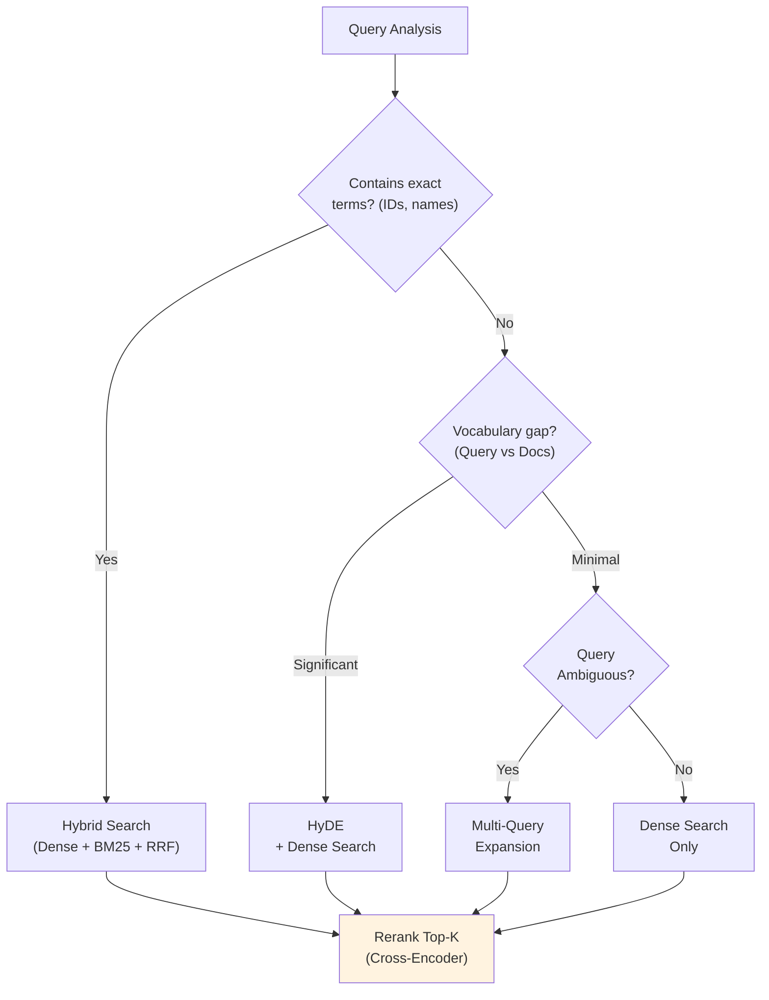

---

## 4. Framework Comparison: Haystack vs LangChain

### 4.1 Philosophy Differences

Both Haystack and LangChain build RAG systems, but with different philosophies that affect how you think about and structure your code.

**Haystack 2.x** (deepset):
- **Pipeline-centric:** Components connected through explicit data flow
- **Type-safe:** Inputs and outputs validated at pipeline build time
- **Production-focused:** Designed for deployment, not just prototyping
- **Deliberate API:** Changes are infrequent and well-considered

**LangChain 1.x** (reached 1.0 stability in October 2025):
- **Chain-centric:** Operations composed via pipe operators (LCEL)
- **Flexible:** Maximum adaptability, minimal constraints
- **Ecosystem-rich:** Extensive integrations available
- **Stable API commitment:** Post-1.0, no breaking changes until 2.0

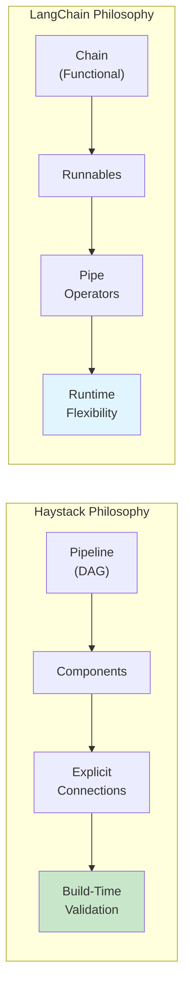

### 4.2 The Same RAG Pipeline in Both Frameworks

To understand the differences concretely, here's the same RAG functionality in both frameworks.

```python
"""
Framework Comparison: Haystack vs LangChain
===========================================

Same task: Retrieve documents, build prompt, generate answer.
Different philosophies in how code is structured.

See haystack_rag_demo.ipynb and langchain_rag_demo.ipynb for
runnable implementations.
"""

# ============================================================
# Haystack 2.x Pattern
# ============================================================
#
# Pipeline with explicit component connections:
#
#   pipeline = Pipeline()
#   pipeline.add_component("embedder", SentenceTransformersTextEmbedder(...))
#   pipeline.add_component("retriever", InMemoryEmbeddingRetriever(...))
#   pipeline.add_component("prompt", PromptBuilder(...))
#   pipeline.add_component("llm", OllamaGenerator(...))
#
#   # Explicit wiring: output.socket → input.socket
#   pipeline.connect("embedder.embedding", "retriever.query_embedding")
#   pipeline.connect("retriever.documents", "prompt.documents")
#   pipeline.connect("prompt", "llm")
#
#   # Run with named component inputs
#   result = pipeline.run({"embedder": {"text": query}, "prompt": {"query": query}})
#
# Key traits:
#   - Components have unique names
#   - Connections explicitly specify data flow
#   - Type validation at build time (fails early)
#   - Clear debugging: know exactly where data flows

# ============================================================
# LangChain LCEL Pattern
# ============================================================
#
# Chain composition with pipe operators:
#
#   chain = (
#       {"context": retriever | format_docs, "question": RunnablePassthrough()}
#       | prompt
#       | llm
#       | StrOutputParser()
#   )
#
#   # Run with simple input
#   answer = chain.invoke("What is the vacation policy?")
#
# Key traits:
#   - Pipe operator (|) chains left-to-right
#   - RunnableParallel for concurrent branches
#   - RunnablePassthrough passes input unchanged
#   - invoke() takes direct input, framework routes internally
#   - Functional composition style

# ============================================================
# When Each Shines
# ============================================================
#
# Haystack excels when:
#   - Type safety and build-time validation matter
#   - Pipeline will be deployed via Hayhooks
#   - Debugging complex flows is a priority
#   - You want explicit, traceable data flow
#
# LangChain excels when:
#   - Rapid prototyping is the goal
#   - Need specific integrations from ecosystem
#   - Team prefers functional composition style
#   - Flexibility matters more than explicit structure
```

### 4.3 Framework Selection Decision Framework

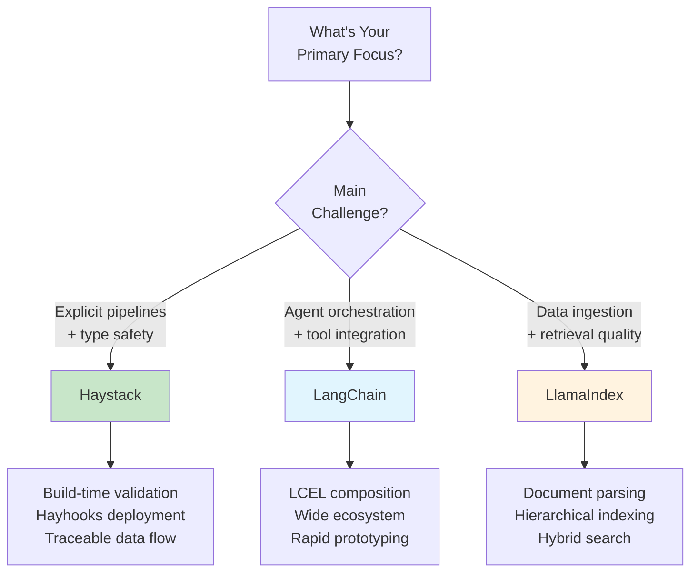

**Honorable Mention: LlamaIndex**

We focused on Haystack and LangChain in this tutorial, but LlamaIndex deserves mention as a strong alternative, particularly for data-intensive RAG:

- **Where it shines:** Document parsing, hierarchical indexing, handling messy unstructured data (PDFs, mixed formats), and retrieval quality optimization
- **Philosophy:** Data-first — focuses on *how you store and index knowledge* rather than orchestration
- **Why not detailed here:** Its API patterns are similar to LangChain (functional composition), so learning one transfers well to the other. The Haystack vs LangChain comparison already illustrates the key architectural trade-off (explicit vs implicit). LlamaIndex sits closer to LangChain philosophically.
- **Common pattern:** Use LlamaIndex as the data layer, expose it as a tool to LangChain/LangGraph agents for orchestration

```python
"""
Framework Selection Guide
=========================

Both frameworks can build production RAG systems. Choose based on
team experience, deployment requirements, and ecosystem needs.
"""

# ============================================================
# Choose Haystack When
# ============================================================

CHOOSE_HAYSTACK = [
    "Production stability is paramount",
    "Team values explicit, debuggable data flow",
    "Data residency and compliance matter",
    "You want build-time type validation",
    "Using Hayhooks for deployment"
]

# ============================================================
# Choose LangChain When
# ============================================================

CHOOSE_LANGCHAIN = [
    "Need maximum ecosystem integrations",
    "Rapid prototyping speed is critical",
    "Building with LangGraph for agent workflows",
    "Team prefers functional composition style",
    "Need features only available in LangChain"
]

# ============================================================
# Quantitative Comparison
# ============================================================

COMPARISON = {
    "framework_overhead": {
        "haystack": "~5.9ms",
        "langchain": "~10ms"
    },
    "token_efficiency": {
        "haystack": "~1.6K tokens for typical RAG",
        "langchain": "~2.4K tokens for typical RAG"
    },
    "learning_curve": {
        "haystack": "Moderate (clear patterns)",
        "langchain": "Steep (large API surface)"
    },
    "breaking_changes": {
        "haystack": "Infrequent, documented migration",
        "langchain": "Frequent, sometimes disruptive"
    }
}

# ============================================================
# Hybrid Approach (Common in Production)
# ============================================================

HYBRID_PATTERN = """
Many production systems mix frameworks based on strengths:

- LangGraph/LangChain for agent orchestration and tool integration
- LlamaIndex for document ingestion, parsing, and retrieval optimization
- Haystack for explicit, type-safe processing pipelines
- Direct API calls for simple operations (no framework overhead)

Common combinations:
- LlamaIndex (data layer) + LangChain (orchestration layer)
- Haystack (ingestion) + LangGraph (agents)

This isn't a cop-out—it's pragmatic. Each framework excels at
different things. Use the right tool for each job.
"""
```

---

## 5. Vector Database Patterns

### 5.1 Qdrant: Purpose-Built Vector Search

**Qdrant** is a purpose-built vector database written in Rust, with sophisticated filtering, hybrid search, and production-grade performance. Popular with organizations that have data residency requirements due to its self-hosting capabilities and European origin.

```python
"""
Qdrant Overview
===============
See qdrant_demo.ipynb for runnable examples.

Core Concepts:
  - collection: Container for vectors (like a table)
  - point: A vector + payload (metadata)
  - payload: JSON metadata for filtering
  - named_vectors: Multiple vectors per point

Key Features:
  - ACORN algorithm for optimized filtered search
  - Native hybrid search (dense + sparse with server-side RRF)
  - Scalar/binary quantization for memory reduction
  - Inline storage for disk efficiency

Why Qdrant:
  - Rust performance, competitive latency
  - Complex filter handling without accuracy loss
  - Full self-hosting control, no vendor lock-in

Benchmarks (source: qdrant.tech/benchmarks, June 2024):
  - Achieves highest RPS and lowest latencies vs competitors in most scenarios
  - 4x RPS gains on some datasets compared to previous versions
  - Test setup: Azure Cloud, 8 vCPU, 32 GiB memory
  - Datasets: dbpedia-openai-1M (1536 dim), deep-image-96 (10M vectors)
  - Note: Run your own benchmarks - results vary by dataset and config
"""

# ============================================================
# Collection Setup Pattern
# ============================================================
#
# from qdrant_client import QdrantClient
# from qdrant_client.models import VectorParams, Distance, Filter, FieldCondition, MatchValue
# client = QdrantClient(url="http://localhost:6333")

# Create collection with HNSW index
client.create_collection(
    collection_name="documents",
    vectors_config=VectorParams(
        size=1536,            # embedding dimension
        distance=Distance.COSINE
    ),
    hnsw_config={
        "m": 16,              # connections per node (memory vs recall)
        "ef_construct": 100   # build-time search width (quality vs speed)
    },
    on_disk_payload=True      # disk storage for large collections
)

# Search with tenant filtering (query_points replaces search in v1.16+)
results = client.query_points(
    collection_name="documents",
    query=query_embedding,
    query_filter=Filter(must=[
        FieldCondition(key="tenant_id", match=MatchValue(value="acme_corp")),
        FieldCondition(key="doc_type", match=MatchValue(value="policy"))
    ]),
    limit=10,
    with_payload=True
)
```

### 5.2 pgvector: PostgreSQL-Native Vector Search

**pgvector** enables vector search within PostgreSQL, ideal for organizations with existing PostgreSQL infrastructure who want to avoid adding another database.

```python
"""
pgvector Overview
=================
See pgvector_demo.ipynb for runnable examples.

Why pgvector:
  - Single database for vectors + metadata + transactions
  - Standard PostgreSQL operations, backups, monitoring
  - Native Row-Level Security (RLS) for multi-tenancy
  - No additional infrastructure to deploy

Practical Limits:
  - Best for <100M vectors without heavy tuning
  - HNSW index requires more memory than purpose-built DBs
  - Index builds can lock tables

Key Features:
  - Iterative scans (prevent overfiltering)
  - Parallel index builds
  - sparsevec type for SPLADE/BM25
  - halfvec for memory savings

Benchmarks (source: jkatz.github.io, April 2024):
  - 150x index build speedup (v0.5.0 → v0.7.0 with binary quantization)
  - 30x QPS boost, ~30x p99 latency improvement (HNSW vs IVFFlat @ 99% recall)
  - dbpedia-openai-1000k: 253 QPS, 5.5ms p99 latency @ 99% recall
  - Scalar quantization (halfvec): 50x faster index build, 2x memory savings
  - Test setup: AWS r7gd.16xlarge (64 vCPU, 512 GiB RAM)
"""

# ============================================================
# SQL Patterns
# ============================================================
#
# Table with vector column:
#
#   CREATE TABLE documents (
#       id SERIAL PRIMARY KEY,
#       tenant_id VARCHAR(64) NOT NULL,
#       content TEXT,
#       embedding vector(1536)
#   );
#
# HNSW index:
#
#   CREATE INDEX ON documents
#   USING hnsw (embedding vector_cosine_ops)
#   WITH (m = 16, ef_construction = 64);
#
# Similarity search with filtering:
#
#   SELECT id, content, 1 - (embedding <=> query_embedding) AS similarity
#   FROM documents
#   WHERE tenant_id = 'acme_corp'
#   ORDER BY embedding <=> query_embedding
#   LIMIT 10;
```

### 5.3 Vector Database Selection

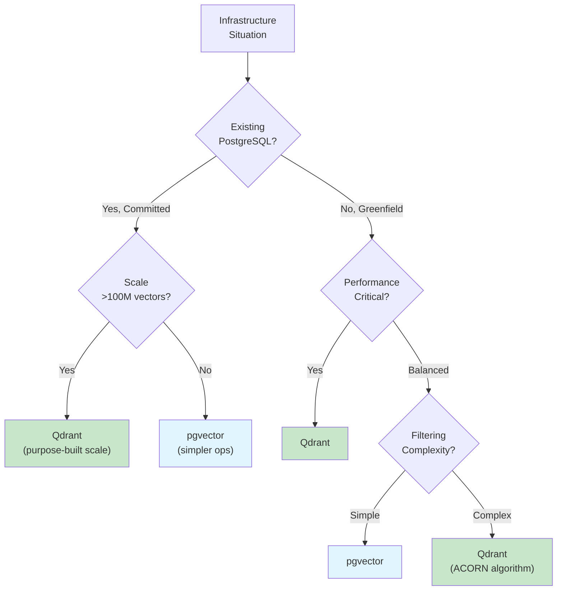

### 5.4 Multi-Tenancy Patterns

Multi-tenancy—serving multiple customers from shared infrastructure—requires careful design for data isolation, performance isolation, and cost efficiency.

```python
"""
Multi-Tenancy Patterns
======================

Choose isolation level based on compliance requirements,
tenant count, and operational complexity tolerance.

Pattern 1: Payload Filtering (Lowest Isolation)
  - Single collection, tenant_id in metadata
  - Filter by tenant_id on every query
  - Scale: Thousands of tenants, simple setup
  - Risk: Noisy neighbor (one tenant's load affects others)

Pattern 2: Collection Per Tenant (Medium Isolation)
  - Separate collection per tenant
  - Route to tenant's collection at application layer
  - Scale: Hundreds of tenants (collection overhead)
  - Risk: Operational complexity, resource overhead

Pattern 3: Database Per Tenant (Highest Isolation)
  - Separate database instance per tenant
  - Connection routing at load balancer
  - Scale: Tens of tenants (cost prohibitive at scale)
  - Use case: Regulatory requirements (HIPAA, SOX)

Selection Guidance:
  - Start with payload filtering (simplest)
  - Upgrade when: filtering degrades (>1M vectors/tenant),
    noisy neighbor issues, or compliance requires isolation
  - Avoid database-per-tenant unless: regulatory mandate,
    very small tenant count (<50), or premium tier
"""

# Pattern 1: Payload filtering (start here)
results = client.query_points(
    collection_name="shared_docs",
    query=query_vector,
    query_filter=Filter(must=[FieldCondition(key="tenant_id", match=MatchValue("acme"))])
)

# Pattern 2: Collection per tenant
collection_name = f"tenant_{tenant_id}_docs"
results = client.query_points(collection_name=collection_name, query=query_vector)

# Pattern 3: Database per tenant
client = QdrantClient(url=tenant_db_mapping[tenant_id])
```

### 5.5 Honorable Mentions

We focused on Qdrant and pgvector for their self-hosting capabilities and distinct use cases (purpose-built vs PostgreSQL-native). Other notable vector databases worth considering:

**1. Pinecone**
- Fully managed cloud service, easiest setup (5-line configuration)
- Best for: Startups, rapid prototyping, teams without DevOps capacity
- Trade-off: Proprietary, vendor lock-in, higher cost at scale
- No self-hosting option

**2. Weaviate**
- Open-source with managed cloud option
- Built-in vectorization (can call OpenAI/Cohere directly)
- GraphQL API, strong hybrid search
- Best for: Teams wanting integrated vectorization, GraphQL preference

**3. Milvus**
- Enterprise-grade, designed for massive scale (billions of vectors)
- Multiple index types (IVF, HNSW, DiskANN)
- Best for: Large enterprises with Kubernetes expertise
- Trade-off: Complex deployment, requires significant ops investment

**4. ChromaDB**
- Lightweight, Python-native, embedded database
- Best for: Local development, prototyping, simple use cases
- Trade-off: Not designed for production scale

**Why we detailed Qdrant + pgvector:**
- Qdrant: Purpose-built performance with self-hosting (data residency)
- pgvector: Leverages existing PostgreSQL (no new infrastructure)
- Together they represent the "add new DB" vs "extend existing DB" decision that most teams face

---

## 6. Enterprise Concerns

### 6.1 Semantic Caching

Semantic caching stores responses keyed by query *meaning*, not exact string match. "What's our WFH policy?" can hit a cache entry created for "remote work policy?"

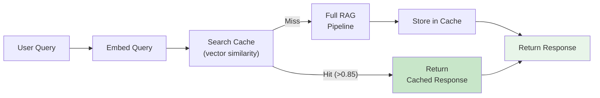

```python
"""
Semantic Caching for RAG
========================

Reduce costs and latency by caching responses for semantically
similar queries, not just exact matches.

How It Works:
  Traditional cache: "What's our WFH policy?" → miss
                     "What's our WFH policy?" → hit (exact match only)
  
  Semantic cache:    "What's our WFH policy?" → miss → store
                     "remote work policy?"    → HIT (similar meaning)

Cost Impact (varies by workload - measure your own):
  - Cache hit rate: 20-40% typical, 60%+ for FAQ workloads
  - Cost reduction: 30-50% on LLM API costs
  - Latency: ~10x improvement (50ms cache vs 500ms full RAG)

Cache Invalidation Strategies:
  - Document update: Hash content, invalidate on change
  - Time-based: TTL of 1-24 hours depending on freshness needs
  - Manual: Admin API to flush specific queries/patterns

Tools:
  - GPTCache: Open source, LangChain integrated, multiple backends
  - Redis + embeddings: Custom implementation, full control
  - Qdrant dual-use: Same store for cache and retrieval
"""

# ============================================================
# Implementation Pattern
# ============================================================

def cached_rag_query(query: str, similarity_threshold: float = 0.85):
    # Step 1: Embed the query
    query_embedding = embed(query)
    
    # Step 2: Search cache for similar queries
    cache_hits = cache_store.search(
        query_embedding, limit=1, score_threshold=similarity_threshold
    )
    
    # Step 3: Return cached response if similar query found
    if cache_hits:
        return cache_hits[0].payload["response"]
    
    # Step 4: Cache miss - run full RAG pipeline
    response = rag_pipeline.run(query)
    
    # Step 5: Store in cache for future queries
    cache_store.upsert(
        id=hash(query),
        vector=query_embedding,
        payload={"query": query, "response": response, "timestamp": now()}
    )
    
    return response
```

### 6.2 LiteLLM Integration for Provider Flexibility

In Part 1B, we covered LiteLLM for model selection and routing. For RAG systems, LiteLLM provides critical flexibility in the generation component, enabling provider switching, fallbacks, and cost optimization without changing application code.

```python
"""
LiteLLM in RAG Architectures
============================

LiteLLM provides a unified interface to 100+ LLM providers,
enabling flexible generation in RAG pipelines.
See litellm_demo.ipynb for runnable examples.

Why LiteLLM for RAG:
  - Provider flexibility: Switch providers without code changes
  - Fallback chains: Automatic failover (Claude → GPT-4 → Llama)
  - Cost routing: Simple queries → cheap models, complex → premium
  - Compliance: Route EU queries to Mistral (EU-based)

Cost Optimization (measure your own savings):
  - Complexity routing: Route by query type to appropriate model tier
  - Semantic routing: Pre-defined routes with example queries
"""

# ============================================================
# Integration Pattern
# ============================================================

from litellm import completion

def generate_response(query: str, context: str, complexity: str):
    model_map = {
        "simple": "gpt-4o-mini",
        "standard": "claude-3-5-sonnet-20241022",
        "complex": "claude-3-opus-20240229",
        "eu_compliant": "mistral/mistral-large-latest"
    }
    
    prompt = f"Context: {context}\n\nQuestion: {query}\n\nAnswer:"
    
    response = completion(
        model=model_map.get(complexity, "standard"),
        messages=[{"role": "user", "content": prompt}],
        fallbacks=["gpt-4o", "claude-3-5-sonnet-20241022"]
    )
    return response.choices[0].message.content

# ============================================================
# LiteLLM + Haystack Integration
# ============================================================

from haystack import component
import litellm

@component
class LiteLLMGenerator:
    def __init__(self, model: str = "gpt-4o-mini", fallbacks: list = None):
        self.model = model
        self.fallbacks = fallbacks or []
    
    @component.output_types(replies=list[str])
    def run(self, prompt: str):
        response = litellm.completion(
            model=self.model,
            messages=[{"role": "user", "content": prompt}],
            fallbacks=self.fallbacks
        )
        return {"replies": [response.choices[0].message.content]}
```

### 6.3 Access Control and Audit Trails

Production RAG must enforce document-level permissions and maintain audit trails for compliance.

```python
"""
Access Control for RAG Systems
==============================

Critical principle: Enforce permissions BEFORE retrieval,
never rely on filtering AFTER generation.
See access_control_demo.ipynb for runnable examples.

Access Control Frameworks:
  - Permit.io: Fine-grained authorization (FGA), LangChain/PydanticAI integrations
  - Cerbos: Enterprise authorization, GDPR/SOC2/HIPAA compliance, audit-ready logs
  - Pangea: Document-level ACLs, vector metadata tagging, LangChain integration
  - LangSmith RBAC: Workspace roles, service keys (Enterprise feature)

Audit Trail / Observability Tools:
  - Langfuse: Open-source, OpenTelemetry support, cost tracking
  - LangSmith: LangChain native, full OTel support, Datadog/Grafana export
  - OpenTelemetry: Standard protocol, GenAI semantic conventions, vendor-agnostic
  - Haystack: Built-in tracing with content_tracing, OpenTelemetry integration

GDPR Considerations:
  - Right to erasure: Document deletion must cascade to vectors
  - Data minimization: Don't log query content if not needed
  - Purpose limitation: Audit logs for compliance only
  - Cross-border: Consider where vectors are stored
"""

# ============================================================
# Pattern 1: Pre-Filter ACLs (Preferred)
# ============================================================
#
# Document metadata includes access control:
#   {"content": "...", "allowed_roles": ["finance"], "allowed_users": ["user_123"]}
#
# Filter at retrieval time (Qdrant example):

results = client.query_points(
    collection_name="documents",
    query=query_embedding,
    query_filter=models.Filter(
        should=[
            models.FieldCondition(
                key="allowed_roles", match=models.MatchAny(any=user.roles)
            ),
            models.FieldCondition(
                key="allowed_users", match=models.MatchValue(value=user.id)
            ),
        ]
    ),
    limit=5
)
# Unauthorized documents never reach the LLM

# ============================================================
# Pattern 2: Haystack with Access Control Filter
# ============================================================

from haystack import Pipeline, component
from haystack.components.retrievers import QdrantRetriever

@component
class SecureRetriever:
    """Wrapper that injects user permissions into retrieval."""
    
    def __init__(self, retriever):
        self.retriever = retriever
    
    @component.output_types(documents=list)
    def run(self, query: str, user_roles: list[str], user_id: str):
        # Build filter based on user permissions
        acl_filter = {
            "should": [
                {"key": "allowed_roles", "match": {"any": user_roles}},
                {"key": "allowed_users", "match": {"value": user_id}}
            ]
        }
        return self.retriever.run(query=query, filters=acl_filter)

# Use in pipeline
pipeline = Pipeline()
pipeline.add_component("retriever", SecureRetriever(qdrant_retriever))

# ============================================================
# Pattern 3: Audit Logging with Haystack Tracing
# ============================================================

import logging
from haystack import tracing
from haystack.tracing.logging_tracer import LoggingTracer

# Enable content tracing for audit (logs queries and responses)
tracing.tracer.is_content_tracing_enabled = True
logging.getLogger("haystack").setLevel(logging.DEBUG)

# For production: Use OpenTelemetry tracer
# from haystack.tracing import OpenTelemetryTracer
# tracing.enable_tracing(OpenTelemetryTracer(...))
```

### 6.4 Cost Optimization Strategies

```python
"""
RAG Cost Optimization
=====================

Systematic approach to reducing RAG system costs.
Percentages are typical ranges - measure your own system.

Cost Breakdown (typical RAG system):
  - Embedding generation: 40-60% of total cost (optimize first)
  - Vector storage: 20-35% of total cost
  - LLM inference: 15-25% of total cost

Tier 1 - Reduce API Calls:
  - Semantic caching: Cache responses by query similarity
  - Prompt caching: Use provider caching (Anthropic, OpenAI)
  - Response caching: Traditional cache for exact matches

Tier 2 - Route to Cheaper Models:
  - Complexity routing: Simple queries → GPT-4o-mini/Haiku
  - Self-hosted embeddings: BGE/Instructor on your infra
    (trade-off: operational overhead)

Tier 3 - Reduce Token Usage:
  - Context compression: Extractive summarization of chunks
  - Output limits: max_tokens parameter, concise prompts
  - Chunking optimization: Right-sized chunks reduce redundancy

Tier 4 - Infrastructure:
  - Batch embeddings: Batch documents, not one-by-one
  - Quantization: 8-bit or binary vectors (trade-off: slight recall loss)
"""

# ============================================================
# Example: Complexity-Based Routing
# ============================================================

def route_by_complexity(query: str, context_length: int) -> str:
    '''Route to appropriate model based on query complexity.'''
    
    # Simple heuristics - replace with classifier for production
    if context_length < 1000 and len(query) < 50:
        return "gpt-4o-mini"  # Fast, cheap
    elif context_length < 4000:
        return "claude-3-5-sonnet-20241022"  # Balanced
    else:
        return "claude-3-opus-20240229"  # Complex reasoning
```

### 6.5 Evaluation Metrics

```python
"""
RAG Evaluation Framework
========================

Metrics to measure and improve RAG system quality.

Retrieval Metrics:
  - Recall@K: Fraction of relevant docs in top K (target: greater than 0.8)
  - Precision@K: Fraction of top K that are relevant (target: greater than 0.6)
  - MRR: Mean Reciprocal Rank of first relevant doc (target: greater than 0.5)

Generation Metrics (RAGAS Framework):
  - Faithfulness: Is answer supported by context? (target: greater than 0.8)
    Measures hallucination prevention
  - Answer Relevancy: Does answer address the question? (target: greater than 0.7)
    Semantic similarity to question
  - Context Precision: Are relevant chunks ranked higher? (target: greater than 0.6)
    Position-weighted relevance score

Production Monitoring:
  - Sample rate: 5-10% of production queries
  - Evaluation: LLM-as-judge (~80% agreement with humans)
  - Alert thresholds: faithfulness less than 0.8, latency p99 greater than 3s, error rate greater than 1%
  - Review cadence: weekly (quality/cost), monthly (model selection), quarterly (dataset refresh)
"""

# ============================================================
# Example: Simple Faithfulness Check
# ============================================================

def check_faithfulness(response: str, context: str, llm) -> float:
    '''
    Use LLM to check if response claims are supported by context.
    Returns score between 0 and 1.
    '''
    prompt = f'''
    Given the context and response, rate how well the response
    is supported by the context (0-1 scale).
    
    Context: {context}
    Response: {response}
    
    Score (just the number):
    '''
    score = float(llm.generate(prompt).strip())
    return min(1.0, max(0.0, score))
```

---

## Summary: Key Takeaways

### RAG Architecture
- Start with naive RAG for prototypes; add complexity only when measurements show problems
- Advanced RAG (pre/post-retrieval optimization) handles most production needs
- Modular RAG enables dynamic routing and iteration
- Agentic RAG suits multi-step reasoning but adds 2-5x latency

### Chunking
- Recursive character splitting at 400 tokens with 0 overlap is the pragmatic default
- Late chunking (embed first, chunk later) is the 2024 breakthrough for context preservation
- Contextual retrieval provides maximum accuracy at higher indexing cost
- Match strategy to document value: high-value → contextual, high-volume → recursive

### Retrieval
- Hybrid search (dense + sparse + RRF) outperforms either alone
- Reranking with cross-encoders is the highest-impact quality optimization
- Query transformation (HyDE, multi-query) bridges vocabulary gaps
- Always measure retrieval quality separately from generation quality

### Frameworks
- Haystack 2.x for production stability and explicit data flow
- LangChain for ecosystem breadth and rapid prototyping
- Many production systems combine both strategically

### Vector Databases
- Qdrant for performance-critical and complex filtering workloads
- pgvector for PostgreSQL-native architectures under 100M vectors
- Start with payload filtering for multi-tenancy; escalate only when needed

### Enterprise Concerns
- Semantic caching: 20-40% cost reduction on typical workloads
- LiteLLM: Provider flexibility, fallbacks, and cost routing for generation
- Access control: Enforce before retrieval, never after generation
- Evaluation: RAGAS metrics in CI/CD, LLM-as-judge for production monitoring

---

## What's Next: Part 2B

With the conceptual foundation established, Part 2B builds a complete **Enterprise Document Intelligence System**:

- **Architecture:** API Gateway (Kotlin), Document Service, RAG Service (Haystack + LiteLLM), Admin Service
- **Data Layer:** Qdrant for vectors, PostgreSQL for metadata, Redis for semantic caching, MinIO for files
- **Features:** Multi-format ingestion, hybrid search, tenant isolation, semantic caching, provider flexibility
- **Evaluation:** RAGAS metrics, retrieval quality monitoring, cost tracking

You'll get an implementation roadmap, component specifications, and patterns you can adapt for your own production RAG system.

---

*Next in series: Part 2B — Building Enterprise Document Intelligence*

---

## Companion Notebook Requirements

The following demos should be included in `2A/rag_concepts_demo.ipynb`:

1. **Chunking Strategy Comparison**
   - Fixed-size vs recursive vs semantic on sample documents
   - Measure chunk quality with embedding coherence

2. **Late Chunking Demo** (requires Jina API or compatible model)
   - Traditional vs late chunking comparison
   - Retrieval quality measurement

3. **Hybrid Search Implementation**
   - BM25 + dense retrieval + RRF fusion
   - Compare to dense-only and sparse-only

4. **Reranking Impact Measurement**
   - Before/after reranking quality metrics
   - Latency overhead measurement

5. **Embedding Model Comparison**
   - OpenAI vs BGE vs Jina embeddings
   - Quality vs cost vs latency tradeoffs

6. **LiteLLM Provider Switching**
   - Same RAG query across multiple providers
   - Fallback chain demonstration

---

**About this series:** "AI: Through an Architect's Lens" is a tutorial series for senior engineers building AI systems. Each part combines conceptual understanding with practical decision frameworks.
